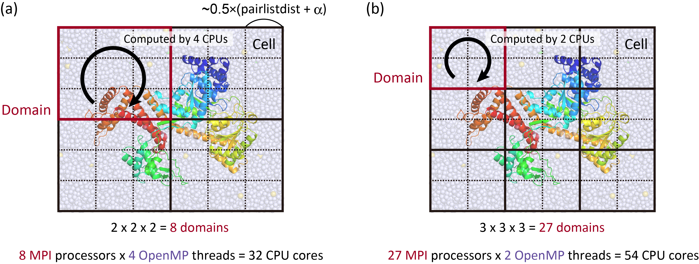

.. highlight:: bash
.. _available_programs:

=======================================================================
Available Programs 
=======================================================================

Simulators
=======================================================================

Basic functions
---------------

**atdyn**

  The simulator that is parallelized with the atomic decomposition scheme.
  In most cases, **atdyn** is applied to small systems or coarse-grained systems.
  The program runs on CPU with the hybrid MPI+OpenMP protocol, where
  only double-precision calculation is available.
  Since the atomic decomposition is a simple parallelization scheme,
  the source code is actually simple compared to that for the domain decomposition.
  Therefore, this program is also useful to develop a new function of **GENESIS**.

**spdyn**

  The simulator that is parallelized with the domain decomposition scheme.
  The program is designed to achieve high-performance molecular dynamics simulations,
  such as micro-second simulations and cellular-scale simulations.
  The program runs on not only CPU but also CPU+GPU with the hybrid MPI+OpenMP protocol.
  Here, beside double-precision, mixed-precision calculations are also available.
  In the mixed-precision model, force calculations are carried out with single precision,
  while integration of the equations of motion as well as accumulation of the force and
  energy are done with double-precision.

.. list-table::
   Available functions in **atdyn** and **spdyn**
  :header-rows: 1
  :widths: 13, 10, 10

  * - Function
    - atdyn
    - spdyn
  * - Energy minimization
    - :math:`\bigcirc` (SD and LBFGS)
    - :math:`\bigcirc` (SD)
  * - All-atom molecular dynamics
    - :math:`\bigcirc`
    - :math:`\bigcirc`
  * - Coarse-grained molecular dynamics
    - :math:`\bigcirc`
    - :math:`\bigcirc` (Only Martini)
  * - Implicit solvent model
    - :math:`\bigcirc`
    - :math:`-`
  * - Replica-exchange method
    - :math:`\bigcirc`
    - :math:`\bigcirc`
  * - Gaussian accelerated MD
    - :math:`\bigcirc`
    - :math:`\bigcirc`
  * - Reaction path search
    - :math:`\bigcirc` (MEP and MFEP)
    - :math:`\bigcirc` (MFEP)
  * - QM/MM calculation
    - :math:`\bigcirc`
    - :math:`-`
  * - Vibrational analysis
    - :math:`\bigcirc`
    - :math:`-`
  * - Cryo-EM flexible fitting
    - :math:`\bigcirc`
    - :math:`\bigcirc`
  * - Precision
    - double
    - double/mixed/single
  * - GPGPU calculation
    - :math:`-`
    - :math:`\bigcirc` (All-atom MD)
  * - Parallel I/O
    - :math:`-`
    - :math:`\bigcirc`

Atomic and domain decomposition schemes
---------------------------------------

In the atomic decomposition MD, which is also called a replicated-data MD algorithm,
all MPI processors have the same coordinates data of all atoms in the system.
MPI parallelization is mainly applied to the "DO loops" of the bonded and
non-bonded interaction pair lists for the energy and force calculations.
:numref:`parallel_scheme` (a) shows a schematic representation of the atomic decomposition scheme
for the non-bonded interaction calculation in a Lennard-Jones system,
where 2 MPI processors are used.
In this scheme, MPI_ALLREDUCE must be used to accumulate all the atomic forces every step,
resulting in large communication cost.

In the domain-decomposition MD, which is also called a
distributed-data MD algorithm, the whole system is decomposed into domains
according to the number of MPI processors, and each MPI processor is assigned to a specific domain.
Each MPI processor handles the coordinates data of the atoms
in the assigned domain and in the buffer regions near the domain boundary,
and carries out the calculation of the bonded and non-bonded interactions
in the assigned domain, enabling us to reduce computational cost.
In this scheme, communication of the atomic coordinates and
forces in the buffer region is essential.
:numref:`parallel_scheme` (b) is a schematic representation of the domain decomposition scheme,
where the system is decomposed into two domains to use 2 MPI processors.
Note that in the figure the system periodicity is not considered for simplicity.

.. figure:: _figures/Parallel_scheme.png
   :width: 80 %
   :align: center
   :name: parallel_scheme
   :alt: 

   Parallelization scheme in the (a) atomic decomposition and (b) domain decomposition.

Hybrid MPI+OpenMP calculation in SPDYN
--------------------------------------

The users had better understand the basic scheme of parallel calculation in **SPDYN**
to get the best performance in the calculation.
As described above, the simulation box is divided into domains
according to the number of MPI processors.
Each domain is further divided into smaller cells, each of whose size is adjusted to be
approximately equal to or larger than the half of "pairlistdist + :math:`\alpha`".
Here, "pairlistdist" is specified in the control file, and :math:`\alpha` depends on the
algorithms used in the simulation (see the next subsection).
Note that all domains or cells have the same size with a rectangular or cubic shape.
Each MPI processor is assigned to each domain, and data transfer or communication
about atomic coordinates and forces is achieved between only neighboring domains.
In addition, calculation of bonded and non-bonded interactions in each domain is
parallelized based on the OpenMP protocol.
These schemes realize hybrid MPI+OpenMP calculation, which is more efficient than
flat MPI calculation on recent computers with multiple CPU cores.
Because MPI and OpenMP are designed for distributed-memory and shared-memory
architectures, respectively, MPI is mainly used for parallelization between
nodes and OpenMP is used within one node.

The following figures illustrate how the hybrid MPI+OpenMP calculations are achieved in **SPDYN**.
In :numref:`domain_decomposition` (a) and 2(b), 8 MPI processors with 4 OpenMP threads (32 CPU cores
in total), and 27 MPI processors with 2 OpenMP threads
(54 CPU cores in total) are used, respectively.
In these Figures, only XY dimensions are shown for simplicity.

   Schematic representation of the hybrid MPI+OpenMP calculation in SPDYN.

For Case (a), the following commands are used:
:: 
  $ export OMP_NUM_THREADS=4
  $ mpirun -np 8 ~/genesis/genesis-2.0.0/bin/spdyn INP > log

For Case (b), the following commands are used:
:: 
  $ export OMP_NUM_THREADS=2
  $ mpirun -np 27 ~/genesis/genesis-2.0.0/bin/spdyn INP > log

In the log file, the users can check whether the given numbers of MPI processors
and OpenMP threads are actually employed or not.
The following information should be found in the log file for instance for Case (a):
:: 

  [STEP2] Setup MPI

  Setup_Mpi_Md> Summary of Setup MPI
    number of MPI processes   =          8
    number of OpenMP threads  =          4
    total number of CPU cores =         32

.. note::
  In most cases, the number of domains in each dimension is automatically
  determined according to the given number of MPI processors.
  However, if such automatic determination is failed, the users must specify
  the number of domains explicitly in the control file (see :ref:`boundary`).

Limitation of the available MPI processors
------------------------------------------

Basically, there is no strict limitation in the available number of MPI processors in **ATDYN**.
However, there are a few limitations in **SPDYN**.
First, the number of domains must be equal to the number of MPI processors (conventional MD) 
or divisor of the number of MPI processors (when enhanced sampling with replicas is used).
Second, one domain must be composed of at least 8 cells (= :math:`2{\times}2{\times}2`),
where the cell size in one dimension is automatically set to be larger than 
the half of "pairlistdist + :math:`\alpha`".
Here, ":math:`\alpha` = 2.0 + cell_size_buffer (default = 0.6)" (see :ref:`Boundary`).
According to this rule, the available maximum number of MPI processors (:math:`N_{\rm max}`) for the target system is determined.
For example, if the box size of your target system is :math:`64{\times}64{\times}64 \text{\AA}^3`,
and "pairlistdist=13.5" is specified in the control file,
:math:`N_{\rm max}` is :math:`4{\times}4{\times}4 = 64`.

If the domains and cells are successfully determined, they can be seen in the early part of the log file.
The following example is corresponding to the situation in :numref:`domain_decomposition` (b).
::

  Setup_Boundary_Cell> Set Variables For Boundary Condition
    domains (x,y,z) =          3         3         3
    ncells (x,y,z)  =          6         6         6

If the users encountered the following error message,
the problem is probably related to the above rule, where the specified number
of MPI processors might exceed :math:`N_{\rm max}`.
In this case, if the users want to use much more CPU cores than :math:`N_{\rm max}`,
the number of OpenMP threads should be increased instead of the MPI processors.
::

  Setup_Processor_Number> Cannot define domains and cells. Smaller or
  adjusted MPI processors, or shorter pairlistdist, or larger boxsize
  should be used.

In the MD simulation with the NPT ensemble, this rule becomes more important,
because the box size (or cell size) can change during the simulation.
In fact, the number of domains in each dimension is initially fixed in the simulation.
But, during the NPT simulation the number of cells can be
changed and adjusted to keep the cell size larger than the half of "pairlistdist + :math:`\alpha`".
If the box size is decreased during the simulation, and the number of cells in one dimension of the
domain unfortunately becomes one, the calculation stops immediately because of the violation of the above rule.
The users may often encounter this situation if the number of cells in one dimension of the domain
is just two at the beginning of the MD simulation, and the simulation box has significantly shrunk during the simulation.
To avoid such problems, the users may have to use smaller number of MPI processors
(which makes cells larger) or shorter pairlistdist (making much cells in one domain),
or reconstruct a larger system.

Available sections
------------------

Fundamental functions in **SPDYN** and **ATDYN** are energy minimization (Min),
molecular dynamics method (MD), replica-exchange method (REMD),
string method (String), and vibrational analysis (Vib).
As shown in the last part of the previous chapter, the users carry out simulations
of these methods by writing related sections in the control file.
The users can extend these fundamental functions by combining various sections.
For example, to run a "restrained" MD simulation, the users
add **[SELECTION]** and **[RESTRAINTS]** sections in the control file of the "normal" MD simulation.
The following table summarizes the available sections in each function.
Detailed usage of each section is described in this user guide,
and also in the online tutorials (https://www.r-ccs.riken.jp/labs/cbrt/).

.. list-table::
      Available sections in each algorithm and method
  :header-rows: 1
  :widths: 25, 10, 10, 10, 10, 10, 25

  * - Section
    - Min
    - MD
    - REMD
    - String
    - Vib
    - Description
  * - [INPUT]
    - :math:`\bigcirc`
    - :math:`\bigcirc`
    - :math:`\bigcirc`
    - :math:`\bigcirc`
    - :math:`\bigcirc`
    - :ref:`Input`
  * - [OUTPUT]
    - :math:`\bigcirc`
    - :math:`\bigcirc`
    - :math:`\bigcirc`
    - :math:`\bigcirc`
    - :math:`\bigcirc`
    - :ref:`Output`
  * - [ENERGY]
    - :math:`\bigcirc`
    - :math:`\bigcirc`
    - :math:`\bigcirc`
    - :math:`\bigcirc`
    - :math:`\bigcirc`
    - :ref:`Energy`
  * - [BOUNDARY]
    - :math:`\bigcirc`
    - :math:`\bigcirc`
    - :math:`\bigcirc`
    - :math:`\bigcirc`
    - :math:`\bigcirc`
    - :ref:`Boundary`
  * - [DYNAMICS]
    - :math:`-`
    - :math:`\bigcirc`
    - :math:`\bigcirc`
    - :math:`\bigcirc`
    - :math:`-`
    - :ref:`Dynamics`
  * - [CONSTRAINTS]
    - :math:`-`
    - :math:`\bigcirc`
    - :math:`\bigcirc`
    - :math:`\bigcirc`
    - :math:`-`
    - :ref:`Constraints`
  * - [ENSEMBLE]
    - :math:`-`
    - :math:`\bigcirc`
    - :math:`\bigcirc`
    - :math:`\bigcirc` 
    - :math:`-`
    - :ref:`Ensemble`
  * - [MINIMIZE]
    - :math:`\bigcirc`
    - :math:`-`
    - :math:`-`
    - :math:`\bigcirc`
    - :math:`\bigcirc`
    - :ref:`Minimize`
  * - [REMD]
    - :math:`-`
    - :math:`-`
    - :math:`\bigcirc`
    - :math:`-`
    - :math:`-`
    - :ref:`REMD`
  * - [RPATH]
    - :math:`-`
    - :math:`-`
    - :math:`-`
    - :math:`\bigcirc`
    - :math:`-`
    - :ref:`RPATH`
  * - [VIBRATION]
    - :math:`-`
    - :math:`-`
    - :math:`-`
    - :math:`-`
    - :math:`\bigcirc`
    - :ref:`Vibration`
  * - [SELECTION]
    - :math:`\bigcirc`
    - :math:`\bigcirc`
    - :math:`\bigcirc`
    - :math:`\bigcirc`
    - :math:`\bigcirc`
    - :ref:`Selection`
  * - [RESTRAINTS]
    - :math:`\bigcirc`
    - :math:`\bigcirc`
    - :math:`\bigcirc`
    - :math:`\bigcirc`
    - :math:`\bigcirc`
    - :ref:`Restraints`
  * - [FITTING]
    - :math:`\bigcirc`
    - :math:`\bigcirc`
    - :math:`\bigcirc`
    - :math:`\bigcirc`
    - :math:`\bigcirc`
    - :ref:`fitting`
  * - [GAMD]
    - :math:`-`
    - :math:`\bigcirc`
    - :math:`\bigcirc`
    - :math:`-`
    - :math:`-`
    - :ref:`GAMD`
  * - [QMMM]
    - :math:`\bigcirc`
    - :math:`\bigcirc`
    - :math:`\bigcirc`
    - :math:`\bigcirc`
    - :math:`\bigcirc`
    - :ref:`QMMM`
  * - [EXPERIMENTS]
    - :math:`\bigcirc`
    - :math:`\bigcirc`
    - :math:`\bigcirc`
    - :math:`-`
    - :math:`-`
    - :ref:`Experiments`

Analysis tools
=======================================================================

The following programs are available as the trajectory analysis tools in **GENESIS**.
Basic usage of each tool is similar to that of **spdyn** or **atdyn**.
The users can generate a template control file for each program
by using the "[program_name] -h ctrl" command.
The control file is mainly composed of INPUT, OUTPUT, TRAJECTORY,
FITTING, SELECTION, and OPTION sections.
The trajectory files to be analyzed are specified in the **[TRAJECTORY]** section,
and the parameters used in the analysis are specified in the **[OPTION]** section.
Note that the required sections are depending on the program.
For example, **eigmat_analysis** requires only INPUT and OUTPUT sections.
Detailed usage of each tool is described in the online tutorial.

Trajectory analysis
-------------------

**comcrd_analysis**

  Analyze the coordinates of the center of mass of the selected atoms.

**diffusion_analysis**

  Analyze the diffusion constant.

**distmat_analysis**

  Analyze the matrix of the averaged distance between all pairs of atoms.

**drms_analysis**

  Analyze the distance RMSD of the selected atoms
  with respect to the reference structure.

**fret_analysis**

  Analyze the FRET efficiency between two dyes.

**hb_analysis**

  Analyze the hydrogen bond formed in the selected two atom groups.

**lipidthick_analysis**

  Analyze the membrane thickness.

**msd_analysis**

  Analyze the mean-square displacement (MSD) of the selected atoms or molecules.

**qval_analysis**

  Analyze the fraction of native contacts (Q-value) in the selected atom group.

**rg_analysis**

  Analyze the radius of gyration of the selected atoms.

**rmsd_analysis**

  Analyze the root-mean-square deviation (RMSD) of the selected atoms
  with respect to the reference structure.

**tilt_analysis**

  Analyze the tilt angle of transmembrane helix.

**trj_analysis**

  Analyze the distance, angle, dihedral angle, distance of the centers of mass (COM)
  of the selected atom groups, angle of the COM of the selected atom groups,
  and dihedral angle of the COM of the selected atom groups.

Principal component analysis (PCA)
----------------------------------

**avecrd_analysis**

  Calculate the average structure of the target molecule.

**flccrd_analysis**

  Calculate the variance-covariance matrix from the trajectories and averaged coordinates.
  This tool can be also used to calculate root-mean-square fluctuation (RMSF). 

**eigmat_analysis**

  Diagonalize the variance-covariance matrix in PCA.

**prjcrd_analysis**

  Project the trajectories onto PC axes.

**pcavec_drawer**

  Create a script for VMD and PyMOL to visualize PC vectors obtained from eigmat_analysis. 

Trajectory and restart file converter
-------------------------------------

**crd_convert**

  Convert trajectories to PDB/DCD formats.
  This tool can do centering of the target molecule, 
  fitting of a given atom group to the reference structure, 
  wrapping of molecules into the unit cell,
  combining multiple trajectory files into a single file,
  extraction of coordinates of selected atoms, and so on.

**remd_convert**

  Convert REMD trajectories to those sorted by parameters.
  Since the trajectory files are generated from each replica during the REMD simulations,
  the obtained "raw" trajectories are composed of "mixed" data at various conditions (replica parameters).
  **remd_convert** enables the users to sort the REMD trajectories by parameters.
  This is applicable to not only dcdfile but also energy log files.

**rst_convert**

  Convert GENESIS restart file (rstfile) to the PDB file.

**rst_upgrade**

  Convert old restart file (version < 1.1.0) to that in the new format (version >= 1.1.0).

Free energy calculation
-----------------------

**wham_analysis**

  Free energy analysis using the Weighted Histogram Analysis Method (WHAM). 

**mbar_analysis**

  Free energy analysis using the Multistate Bennett Acceptance Ratio (MBAR) method. 

**pmf_analysis**

  Calculate free energy profile using MBAR output.

**meanforce_analysis**

  Calculate free energy profile along the pathway from RPATH.

Clustering
----------

**kmeans_clustering**

  Carry out k-means clustering for coordinates trajectories

Interface program
-----------------

**dssp_interface**

  Interface program to analyze the protein secondary structure
  in the DCD trajectory file
  using the DSSP program (https://swift.cmbi.umcn.nl/gv/dssp/).

SPANA
-----

SPANA (SPatial decomposition ANAlysis) is developed to carry out trajectory analyses of large-scale biological simulations using multiple CPU cores in parallel. SPANA employs a spatial decomposition of a system to distribute structural and dynamical analyses into the individual CPU core and allows us to reduce the computational time for the analysis significantly. SPANA is suitable for the analysis of systems with multiple macromolecules (such as cellular crowding systems) under the periodic boundary condition.

**contact_analysis**

  Calculate the number of close atomic pairs between given molecules. The close atomic pairs (or atomic contacts) are defined if the closest atom-atom distance between two macromolecules is shorter than given cutoff distance. This program also finds the closest atom pairs between macromolecule pairs within the cutoff distance.

**density_analysis**

  Calculate 3D density distribution of atoms and output the density in X-PLOR/CCP4/DX format.

**hbond_analysis**

  Analyze hydrogen bonds formed between two selected atom groups.

**rdf_analysis**

  Calculate the radial distribution function (RDF) and proximal distribution function (PDF) of molecules (as solvent) around the target group (as solute). PDF provides density of solvent as function of the distance to the surface of macromolecules.

**sasa_analysis**

  Calculate solvent accessible surface area (SASA) of the target molecules. This program outputs not only the total SASA but also the SASA for each atom in the target molecules. 

Other utilities
---------------

**rpath_generator**

  Generate inputs for the string method.
  This tool is usually used after targeted MD simulation
  for generating an initial pathway for the subsequent string method.

**pathcv_analysis**

  Calculate tangential and orthogonal coordinates to a pathway from samples.

**qmmm_generator**

  Generate a system for QM/MM calculation from MD data.

**emmap_generator**

  Generate cryo-EM density map from PDB file.

Parallel I/O tools
=======================================================================
**SPDYN** can be employed with the parallel I/O protocol to achieve massively parallel computation.
Since **SPDYN** is parallelized with the domain decomposition scheme,
each MPI processor has the coordinates of atoms in the assigned domain.
Therefore, large ammount of communication is needed between MPI processors
to write the coordinates in a single DCD file, which is a waste of time
in the case of the simulations for a huge system like 100,000,000 atoms.
To avoid such situations, file I/O in each node (parallel I/O) is useful.
The following tools are used to handle the files generated from parallel I/O simulations.

**prst_setup**

  This tool divides input files (PDB and PSF) for a huge system into multiple files,
  where each file is assinged to each domain.
  The obtained files can be read as restart files in the **[INPUT]** section.
  Note that **prst_setup** is not compiled with Fujitsu compilers.
  Therefore, if the users are going to perform MD simulations with parallel I/O in Fujitsu supercomputers,
  they must create the files without using Fujitsu compilers elsewhere in advance.
  Even if **prst_setup** and **SPDYN** are compiled with different compilers,
  there is no problem to execute **SPDYN** with parallel I/O.

**pcrd_convert**

  Convert multiple trajectory files obtained from the parallel I/O simulation to a single DCD file.
  This tool has a similar function to **crd_convert**.
