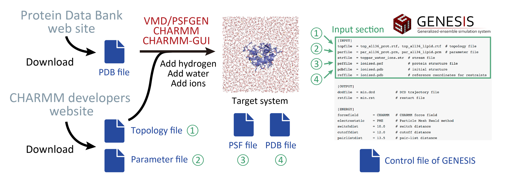

.. highlight:: bash
.. _input:

=======================================================================
Input section
=======================================================================

How to prepare input files
==========================

In order to run MD simulations, the users have to prepare input files that contains 
information about the coordinates of the initial structure as well as 
topology of the system and force field parameters.
The users first create those input files by using a setup tool, 
and their filenames are specified in the **[INPUT]** section of the control file.
**GENESIS** supports various input file formats such as CHARMM, AMBER, and GROMACS input files. 
Basically, the required input files depend on the force field to be used in the simulation.
The following table summarizes the essential input files and setup tools for each force field.

+--------------------+----------------------------------+---------------------------------+
| Force field        | Input files                      | Setup tool                      |
+====================+==================================+=================================+
| CHARMM             | top, par, psf, pdb (or crd), str | VMD, PSFGEN, CHARMM-GUI, CHARMM |
+--------------------+----------------------------------+---------------------------------+
| AMBER              | prmtop, pdb, (or ambcrd)         | LEaP                            |
+--------------------+----------------------------------+---------------------------------+
| KB Go-model        | top, par, psf, pdb               | MMTSB server                    |
+--------------------+----------------------------------+---------------------------------+
| All-atom Go-model  | grotop, grocrd (or pdb)          | SMOG server, SMOG2              |
+--------------------+----------------------------------+---------------------------------+

CHARMM force field
------------------

One of the commonly used parameters for biomolecules is the CHARMM force field,
which was originally developed by the Karplus group at the Harvard University :cite:`MacKerell:1998`.
The users can obtain the files that contain the force field parameters from the CHARMM group’s web site.
The latest version of the CHARMM force field is C36m :cite:`Huang:2017`. 
In the downloaded file, there are topology and parameter files (e.g., top_all36_prot.rtf and par_all36m_prot.prm).

In order to run MD simulation with the CHARMM force field, the users have to additionally make
a new file that holds the information about the atom connectivity of the “whole” target system.
Note that the topology file (e.g., top_all36_prot.rtf) does not contain such information,
because it is designed to generally define the topology of proteins by dealing with
the 20 amino acid residues as “fragments”. In order to hold the topology information 
of the target system, the users will create a “PSF” file (protein structure file). 
It is commonly used in other MD software, and can be generated from the PDB and
topology files by using VMD/PSFGEN :cite:`Humphrey:1996`, CHARMM-GUI :cite:`Jo:2008`, or the CHARMM program :cite:`CHARMM:Program`.

When the PSF file is created, a“processed”PDB file is also obtained, 
where the atom name or residue name might be changed from those
in the original PDB file. The users must use this PDB file as the input
of the MD simulation, because it has a consistency with the information in PSF.
Consequently, the users need four files (processed PDB, parameter, topology, and PSF)
as the inputs of **GENESIS**. These files are specified in the [INPUT] section
of the control file of **GENESIS**.

AMBER force field
-----------------

The AMBER force field has also been commonly used for the MD simulations of
biomolecules, which was originally developed by the Kollman group at the
University of California, San Francisco :cite:`Cornell:1995`. **GENESIS** can deal with the
AMBER force fields. Basic scheme to prepare the input files for **GENESIS**
is similar to that in the case of CHARMM. The users utilize the LEaP program in AmberTools :cite:`AMBER18:Program`. 
LEaP has a similar function to PSFGEN. After building the target system using LEaP,
the users obtain PRMTOP, CRD, and PDB files. PRMTOP file contains the information about
parameter and topology of the target system, and CRD and PDB files include
the coordinates of atoms in the initial structure. **GENESIS** uses
these files as the inputs.

Other force fields
------------------

**GENESIS** can deal with coarse-grained (CG) models such as the Go-model :cite:`Taketomi:1975` and MARTINI :cite:`Marrink:2007`.
In this case, the users again use external setup tools to build the system and prepare
the parameter and topology files. For the all-atom Go-model :cite:`Whitford:2009`, 
the users use the SMOG server :cite:`Noel:2010` or SMOG2 program :cite:`Noel:2016`, 
which generates grotop and grocrd files. The grotop file contains
the information about parameter and topology, and the grocrd file includes
the coordinates of the initial structure, both of which are the file formats
used in the GROMACS program. For the Karanicolas-Brooks (KB) Go-model :cite:`Karanicolas:2002hl` :cite:`karanicolas2003improved`,
the users use the MMTSB server :cite:`Feig:2004`, which generates par, top, pdb, and psf files.

General input files
===================

**topfile** 

  CHARMM topology file containing information about atom connectivity 
  of residues and other molecules.
  For details on the format, see the CHARMM web site :cite:`CHARMM:Online`. 

**parfile**

  CHARMM parameter file containing force field parameters,
  e.g. force constants and equilibrium geometries.

**strfile**

  CHARMM stream file containing both topology information and parameters.

**psffile**

  CHARMM/X-PLOR 'psffile` containing information of the system
  such as atomic masses, charges, and atom connectivities.

**prmtopfile** 

  AMBER 'PARM' or 'prmtop' file (AMBER7 or later format) containing
  information of the system such as atomic masses, charges, and atom
  connectivities. For details about this format, see the AMBER web site
  :cite:`AMBER:Online`. 

**grotopfile** 

  Gromacs 'top' file containing information of the system
  such as atomic masses, charges, atom connectivities.
  For details about this format, see the Gromacs web site
  :cite:`Gromacs:Online`. 

**pdbfile**

  Coordinates file in the PDB format. 
  If *rstfile* is also specified in the **[INPUT]** section, 
  coordinates in *pdbfile* are replaced with those in *rstfile*.

**crdfile**

  Coordinates file in the CHARMM format. 
  If *pdbfile* is also specified in the **[INPUT]** section, coordinates in *crdfile* are NOT used.
  However, if *pdbfile* is not specified, coordinates in *crdfile* are used.
  If *rstfile* is further specified, coordinates in *rstfile* are used.

**ambcrdfile**

  Coordinates file in the AMBER format (ascii).
  If *pdbfile* is also specified in the **[INPUT]** section, coordinates in *ambcrdfile* are NOT used.
  However, if *pdbfile* is not specified, coordinates in *ambcrdfile* are used.
  If *rstfile* is further specified, coordinates in *rstfile* are used.

**grocrdfile**

  Coordinates file in the GROMACS format (.gro file).
  If *pdbfile* is also specified in the **[INPUT]** section, coordinates in *grocrdfile* are NOT used.
  However, if *pdbfile* is not specified, coordinates in *grocrdfile* are used.
  If *rstfile* is further specified, coordinates in *rstfile* are used.
  Note that velocites and simulation box size in *grocrdfile* are NOT used.

**rstfile**

  Restart file in the GENESIS format.
  This file contains atomic coordinates, velocities, simulation box size, and 
  other variables which are essential to restart the simulation continuously.
  If *rstfile* is specified in the **[INPUT]** section, coordinates in
  *pdbfile*, *crdfile*, *grocrdfile*, or *ambcrdfile* are replaced with those in *rstfile*.
  The box size specified in the **[BOUNDARY]** seciton is also overwritten.
  Note that *pdbfile*, *crdfile*, *grocrdfile*, or *ambcrdfile* should be still specified
  in the **[INPUT]** section, even if *rstfile* is specified.

  Note that the file format of *rstfile* was changed after ver. 1.1.0.
  The *rst_upgrade* tool enables us to change 
  the old format used in ver. 1.0.0 or older to the new one.

Input files for implicit solvent models
=======================================

**eef1file** (for **ATDYN** only)

  If the users employ the EEF1, IMM1, or IMIC model, the **eef1file** should be specified in the **[INPUT]** section.
  This file contains the parameters for the solvation free energy calculation.
  Note that the file is not provided in GENESIS, but available in the CHARMM program package.
  To get the file, the users first have to download CHARMM, and then find *solver.inp* and *solvpar22.inp* in the support/aspara directory.
  The corresponding topology and parameter files are also available in the same directory.

Input files for restraint
=========================

**reffile**

  Reference coordinates (PDB file format) for positional restraints and
  coordinate fitting.
  This file should contain the same total number of atoms as *pdbfile*,
  *crdfile*, *ambcrdfile*, or *grocrdfile*.

**ambreffile**

  Reference coordinates ('amber crd' file format) for positional
  restraints and coordinate fitting.
  This file should contain the same total number of atoms as
  *pdbfile* or *ambcrdfile*.

**groreffile**

  Reference coordinates ('gro' file format) for positional
  restraints and coordinate fitting.
  This file should contain the same total number of atoms as
  *pdbfile* or *grocrdfile*.

**modefile**

  Principal modes used for principal component (PC) restraints.
  This file contains only single column ascii data.
  The XYZ values of each atom's mode vector are stored from ascending order. 

**localresfile** (for **SPDYN** and 'charmm psf' file format only)

  This file defines restraints to be applied in the system.
  If you are not an expert of GENESIS, we strongly recommend you to simply use
  the **[RESTRAINTS]** section for restraint instead of using **localresfile**.
  
  In **localresfile**, only bond, angle, and dihedral angle restraints can be defined.
  In addition, selected atoms in **localresfile** must exist in the same cell 
  in the domain decomposition scheme.
  The restraint energy calculated for the lists in **localresfile** is NOT explicitly
  displayed in the log file. Instead, the local restraint energy is hidden 
  in the conventional bond, angle, and dihedral angle energy terms of the log file.

  The restraint potentials defined in **localresfile** are given by harmonic potentials:

  :math:`U(r) = k\;(r-r_{0})^{2}` for bonds

  :math:`U({\theta}) = k\;({\theta}-{\theta}_{0})^{2}` for bond angles

  :math:`U({\phi}) = k\;({\phi}-{\phi}_{0})^{2}` for dihedral angles

  Here, :math:`r`, :math:`{\theta}`, and :math:`{\phi}` are bond distance,
  angle, and dihedral angles, respectively; subscript :math:`0` denotes their
  reference values; and :math:`k` is the force constant.

  The syntax in **localresfile** is as follows:
  ::

    [BOND/ANGLE/DIHEDRAL]     atom atom [atom [atom]]  k r0

  The users must carefully specify the atom index in this file.
  The atom indexes in **localresfile** must be consistent with
  those in the other input files such as **psffile**.

  The following is an example of **localresfile**:
  ::

    BOND     139 143          2.0 10.0
    ANGLE    233 231 247      3.0 10.0
    DIHEDRAL  22  24  41  43  2.0 10.0

Input files for REMD and RPATH simulations
==========================================

In the REMD or RPATH simulations, input files (mainly coordinates and restart files)
should be prepared for each replica. 
In GENESIS, we can easily specify those multiple files in the **[INPUT]** section.
If we include '{}' in the input filename, {} is automatically replaced with the replica index.
For example, in the case of REMD simulations with 4 replicas, 
we prepare input_1.pdb, input_2.pdb, input_3.pdb, and input_4.pdb,
and specify ``pdbfile = input_{}.pdb`` in the **[INPUT]** section.
This rule is also applicable to the restart filename.

**fitfile** (for RPATH only; GENESIS 1.1.5 or later)

  Reference coordinates for structure fitting.
  This file is only used in the string method. 
  For other cases (MD, MIN, or REMD), 
  *reffile*, *groreffile*, or *ambreffile* is used for reference coordinates for fitting, 
  and this *fitfile* is simply ignored, even if it is specified in the **[INPUT]** section.

Examples
========

MD simulations of proteins in explicit solvent with the CHARMM36m force field:
::

  [INPUT]
  topfile = ../toppar/top_all36_prot.rtf
  parfile = ../toppar/par_all36m_prot.prm
  strfile = ../toppar/toppar_water_ions.str
  psffile = ../build/input.psf
  pdbfile = ../build/input.pdb

MD simulations with positional restraint:
::

  [INPUT]
  topfile = ../toppar/top_all36_prot.rtf
  parfile = ../toppar/par_all36m_prot.prm
  strfile = ../toppar/toppar_water_ions.str
  psffile = ../build/input.psf
  pdbfile = ../build/input.pdb
  reffile = ../build/input.pdb

MD simulations of membrane proteins with the CHARMM36m force field:
::

  [INPUT]
  topfile = ../toppar/top_all36_prot.rtf, ../toppar/top_all36_lipid.rtf
  parfile = ../toppar/par_all36m_prot.prm, ../toppar/par_all36_lipid.prm
  strfile = ../toppar/toppar_water_ions.str
  psffile = ../build/input.psf
  pdbfile = ../build/input.pdb

In this case, we specify multiple top and par files for proteins and lipids separated by commas.

If one line becomes very long, backslash " \\ " can be used as a line continuation character:
::
  [INPUT]
  topfile = ../toppar/top_all36_prot.rtf, \
            ../toppar/par_all36_na.prm,   \
            ../toppar/top_all36_lipid.rtf
  parfile = ../toppar/par_all36m_prot.prm, \
            ../toppar/top_all36_na.rtf,    \
            ../toppar/par_all36_lipid.prm
  strfile = ../toppar/toppar_water_ions.str
  psffile = ../build/input.psf
  pdbfile = ../build/input.pdb

MD simulations with the AMBER force field:
::
  [INPUT]
  prmtopfile = ../build/input.prmtop
  ambcrdfile = ../build/input.crd

MD simulations with the all-atom Go-model:
::
  [INPUT]
  grotopfile = ../build/input.top
  grocrdfile = ../build/input.gro

In this case, we specify grotop and grocrd files obtained from the SMOG server or SMOG2 software.

MD simulation with the EEF1/IMM1/IMIC implicit solvent models (CHARMM19):
::
  [INPUT]
  topfile  = ../support/aspara/toph19_eef1.1.inp
  parfile  = ../support/aspara/param19_eef1.1.inp
  eef1file = ../support/aspara/solvpar.inp
  psffile  = ../build/input.psf
  pdbfile  = ../build/input.pdb

MD simulation with the EEF1/IMM1/IMIC implicit solvent models (CHARMM C36):
::
  [INPUT]
  topfile  = ../support/aspara/top_all36_prot_eef1.1.rtf
  parfile  = ../toppar/par_all36_prot.prm
  eef1file = ../support/aspara/solvpar22.inp
  psffile  = ../build/input.psf
  pdbfile  = ../build/input.pdb

REMD simulations starting from the same initial structure:
::

  [INPUT]
  topfile = ../toppar/top_all36_prot.rtf
  parfile = ../toppar/par_all36m_prot.prm
  strfile = ../toppar/toppar_water_ions.str
  psffile = ../build/input.psf
  pdbfile = ../build/input.pdb

REMD simulations starting from different initial structures:
::

  [INPUT]
  topfile = ../toppar/top_all36_prot.rtf
  parfile = ../toppar/par_all36m_prot.prm
  strfile = ../toppar/toppar_water_ions.str
  psffile = ../build/input.psf
  pdbfile = ../build/input_rep{}.pdb

REMD simulations with restarting:
::

  [INPUT]
  topfile = ../toppar/top_all36_prot.rtf
  parfile = ../toppar/par_all36m_prot.prm
  strfile = ../toppar/toppar_water_ions.str
  psffile = ../build/input.psf
  pdbfile = ../build/input.pdb
  rstfile = run_rep{}.rst
