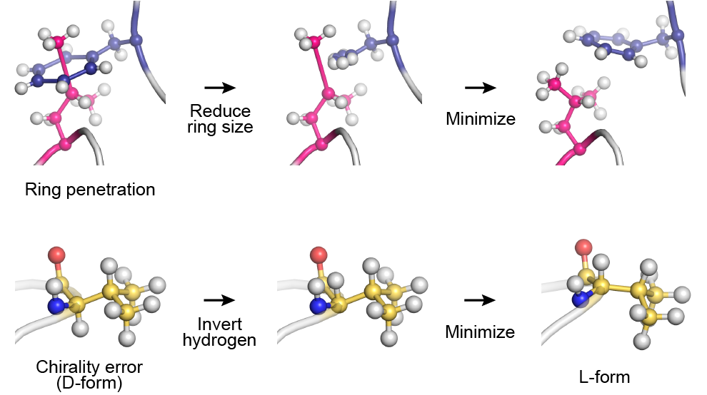

.. highlight:: bash
.. _minimize:

=======================================================================
Minimize section
=======================================================================

Energy minimization
=======================================================================

In the **[MINIMIZE]** section, the user can select methods for energy minimization.
Currently, the steepest descent (SD) algorithm is available in **SPDYN** and **ATDYN**,
and the limited memory version of Broyden-Fletcher-Goldfarb-Shanno (LBFGS) 
is additionally available in **ATDYN**.
Note that constraint algorithms such as SHAKE are not available
in the energy minimization scheme in **GENESIS**.
The energy minimization can be done with restraints (see :ref:`restraints`).

When the energy minimization is carried out for the initial structure,
it is strongly recommended to use the option "contact_check=YES"
in the **[ENERGY]** section (see :ref:`energy`).
This is because the initial structure is usually artificial, and sometimes contains
atomic clashes, where the distance between atoms is very short.
Such strong interactions can generate huge forces on the atoms,
resulting in unstable calculations, which might cause memory errors.

-----------------------------------------------------------------------

**method** *SD / LBFGS*

  **Default : LBFGS** (for **ATDYN**), **SD** (for **SPDYN**)

  Algorithm of minimization.

  * **SD** : Steepest descent method

  * **LBFGS** : Limited memory version of Broyden-Fletcher-Goldfarb-Shanno method (**ATDYN** only)

**nsteps** *Integer*

  **Default : 100**

  Number of minimization steps.

**eneout_period** *Integer*

  **Default : 10**

  Frequency of energy outputs.

**crdout_period** *Integer*

  **Default : 0**

  Frequency of coordinates outputs.

**rstout_period** *Integer*
 
  **Default : 0**

  Frequency of restart file updates.

**nbupdate_period** *Integer*

  **Default : 10**

  Frequency of non-bonded pair-list updates.

**fixatm_select_index** *Integer* (**ATDYN** only)

  **Default : N/A** (all atoms are minimized)

  Index of an atom group to be fixed during minimization.
  The index must be defined in **[SELECTION]** (see :ref:`selection`).
  For example, if the user specifies ``fixatm_select_index = 1``, the reference atoms
  should be members of ``group1`` in the **[SELECTION]**.

**tol_rmsg** *Real* (**ATDYN** only)

  **Default : 0.36** (unit : kcal/mol/:math:`\text{\AA}`)

  Tolerance of convergence for RMS gradient.

**tol_maxg** *Real* (**ATDYN** only)

  **Default : 0.54** (unit : kcal/mol/:math:`\text{\AA}`)

  Tolerance of convergence for maximum gradient.

.. note::
   In **ATDYN**, a minimization run stops when *both* RMSG and MAXG
   become smaller than the tolerance values. 

Steepest descent method
=======================

**force_scale_init** *Real*

  **Default : 0.00005**

  The initial value of the force scaling coefficient in the steepest descent method.
  This value is also used as the minimum value of the scaling coefficient.

**force_scale_max** *Real*

  **Default : 0.0001**

  Maximum value of the force scaling coefficient in the steepest
  descent method.

LBFGS method
============

**ncorrection** *Integer*

  **Default : 10**

  Number of corrections to build the inverse Hessian.

**lbfgs_bnd** *YES / NO*

  **Default : YES**

  Set a boundary to move atoms in each step of minimization.

**lbfgs_bnd_qmonly** *YES / NO*

  **Default : NO**

  Set the boundary only to QM atoms.

**lbfgs_bnd_maxmove** *Real*

  **Default : 0.1** (unit : :math:`\text{\AA}`)

  The maximum size of move in each step.

.. note::
  LBFGS often makes large moves of atoms, especially in the first 
  few steps, which might create a distorted structure. Although this 
  is rarely a problem in MM calculation, it may cause convergence 
  problems in QM calculation. ``lbfgs_bnd`` prevents a huge move by 
  setting a maximum size of move. The size is set by ``lbfgs_bnd_maxmove``.

Macro/micro-iteration scheme in QM/MM
=====================================

In this scheme, the MM region is minimized first while holding the QM 
region fixed. This step is called micro-iteration.  When the MM region 
reaches the minima (or the maximum number of steps), the whole system 
including the QM region is updated. This step is called macro-iteration. 
Then, the MM region is minimized again with the new QM region. The 
micro- and macro-iterations are repeated until a convergence is 
reached.

This scheme requires time-consuming QM calculations only during the 
macro-iteration steps. During the micro-iterations, QM charges are 
used to represent the electrostatic interaction between the QM and 
MM regions.  Therefore, it is far more efficient than the usual scheme, 
and is recommended to use when QM charges are available. 

The keywords in this subsection have no effect in the MM calculations. 

----------------------------------------------------------------------

**macro** *YES / NO*

  **Default : NO**

  Invoke macro/micro-iteration scheme if YES. 

**nsteps_micro** *Integer*

  **Default : 100**

  Number of minimization steps for micro-iterations.

**tol_rmsg_micro** *Real*

  **Default : 0.27** (unit : kcal/mol/:math:`\text{\AA}`)

  Tolerance of convergence for RMS gradient in the micro-iterations.

**tol_maxg_micro** *Real*

  **Default : 0.41** (unit : kcal/mol/:math:`\text{\AA}`)

  Tolerance of convergence for maximum gradient in the micro-iterations.

**macro_select_index** *Integer*

  **Default : QM atoms**

  Index of an atom group to be fixed in the micro-iterations, and
  minimized in the macro-iterations.  The index must be defined in 
**[SELECTION]** (see :ref:`selection`).

Fixing ring penetrations and chirality errors
=============================================

In the energy minimization of GENESIS, the user can automatically fix ring penetration or 
chirality errors in protein, DNA, and RNA.  The suspicious ring is detected based on the 
length of the covalent bonds consisting of the ring.
This algorithm is available when forcefield = CHARMM, CHARMM19, AMBER, or GROAMBER is 
specified in the **[ENERGY]** section.
When using this algorithm, please cite the paper (Mori et al., *J. Chem. Inf. Model.*, 
2021 :cite:`Mori:2021-1`).

   Algorithms for fixing ring penetration and chirality errors.

----------------------------------------------------------------------

**check_structure** *YES / NO* (available for CHARMM, CHARMM19, AMBER, and GROAMBER)

  **Default : YES**

  Detect ring penetrations and chirality errors in the system.

**fix_ring_error** *YES / NO*

  **Default : NO**

  Reduce the ring size of the suspicious ring in the initial structure to fix the ring penetration.

**exclude_ring_grpid** *Integer*

  **Default : N/A**

  Space-separated list of indexes of detected suspicious ring groups.
  Ring groups specified here are ignored during the error fixing even if "fix_ring_error = YES" is specified.
  That is, the size of those rings will not be reduced.

**fix_chirality_error** *YES / NO*

  **Default : NO**

  Invert the position of the hydrogen atom of the suspicious chiral center in the initial structure to fix the chirality error.

**exclude_chiral_grpid** *Integer*

  **Default : N/A**

  Space-separated list of indexes of detected suspicious chiral center.
  Chiral centers specified here are ignored during the error fixing even if "fix_chirality_error = YES" is specified.
  That is, the hydrogen atom of those chiral centers will not be inverted.

----------------------------------------------------------------------

The basic usage of these options is demonstrated below.
First, the user must specify "check_structure = YES", "fix_ring_error = NO", and 
"fix_chirality_error = NO" to just check the errors (default setting).
If there are no suspicious rings or chiral centers in the final snapshot, the 
following messages are displayed:
::
  Check_Ring_Structure> Check ring structure

    No suspicious residue was detected.

  Check_Chirality> Check chirality

    No suspicious residue was detected.

If there are suspicious rings or chiral centers, some warning messages will be 
shown in the last part of the log message:
::
  Check_Ring_Structure> Check ring structure
    suspicious ring group id = 20 : PRO  82 (atom = 1353) max_bond_length ...
    suspicious ring group id = 23 : PHE  93 (atom = 1542) max_bond_length ...
    suspicious ring group id = 49 : PHE 206 (atom = 3440) max_bond_length ...
    suspicious ring group id = 52 : PHE 230 (atom = 3810) max_bond_length ...

    WARNING!
    Some suspicious residues were detected. Minimization might be too short, 
    or "ring penetration" might happen in the above residues.
    Check the structure of those residues very carefully. If you found a ring
    penetration, try to perform the energy minimization again with the 
    options "check_structure = YES" and "fix_ring_error = YES" in [MINIMIZE].
    The energy minimization should start from the restart file obtained
    in "this" run.

Please read the warning message very carefully.
In this example, the user should check the obtained structure around PRO82, PHE93, PHE206, and PHE230 using a molecular viewer like VMD.
Because this is just a warning message, there might be actually no errors.
But, if the user found some errors, energy minimization should be performed again, restarting from this run
with the options "check_structure = YES" and "fix_ring_error = YES" or "fix_chirality_error = YES".
If the user wants to fix only PHE93 and PHE230, they should add the option "exclude_ring_grpid = 20 49",
where "20" and "49" are the "suspicious ring group id" of PRO82 and PHE206, respectively, shown in the warning message.
Note that the reduction of the size of the penetrated ring or inversion of the hydrogen atom in the bad chiral center is carried out for the initial structure.

Examples
========

A 2,000-step energy minimization with the steepest descent method:
::
  [MINIMIZE]
  method           = SD      # Steepest descent
  nsteps           = 2000    # number of minimization steps
  eneout_period    =   50    # energy output period
  crdout_period    =   50    # coordinates output period
  rstout_period    = 2000    # restart output period
  nbupdate_period  =   10    # nonbond pair list update period

An example of LBFGS optimization along with the macro/micro-iteration scheme:
::
  [MINIMIZE]
  method             = LBFGS
  nsteps             = 500  # number of steps
  eneout_period      = 5    # energy output period
  crdout_period      = 5    # coordinates output period
  rstout_period      = 5    # restart output period
  nbupdate_period    = 1    # nonbond pair list update period
  lbfgs_bnd          = yes  # set a boundary to move atoms
  lbfgs_bnd_qmonly   = no   # set the boundary only to QM atoms
  lbfgs_bnd_maxmove  = 0.1  # the max. size of move
  macro              = yes  # switch macro/micro-iteration scheme
  nsteps_micro       = 100  # number of steps of micro-iteration

Energy minimization with automatic fixing for ring penetrations and chirality errors:
::
  [MINIMIZE]
  method              = SD      # Steepest descent
  nsteps              = 2000    # number of minimization steps
  eneout_period       =   50    # energy output period
  crdout_period       =   50    # coordinates output period
  rstout_period       = 2000    # restart output period
  nbupdate_period     =   10    # nonbond pair list update period
  check_structure     =  YES    # check ring penetration and chirality error
  fix_ring_error      =  YES    # automatically fix the ring penetrations
  fix_chirality_error =  YES    # automatically fix the chirality errors
