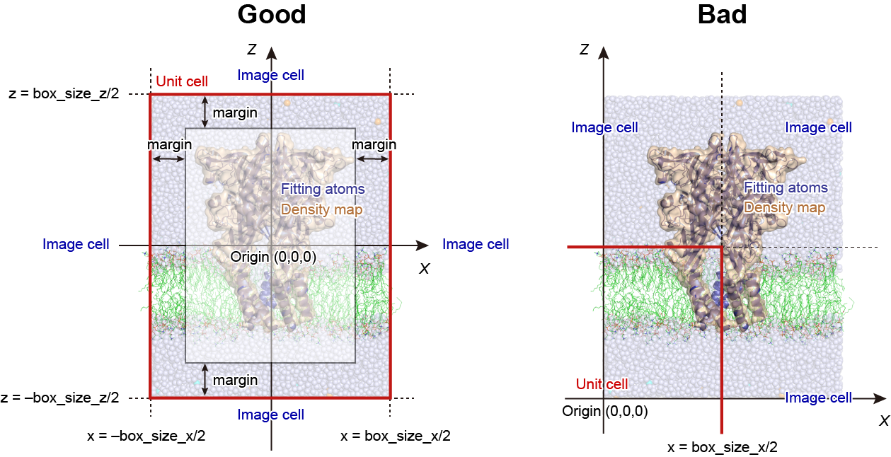

.. highlight:: bash
.. _experiments:

=======================================================================
Experiments section
=======================================================================

Cryo-EM flexible fitting
========================

Theory
------

Cryo-electron microscopy (Cryo-EM) is one of the most powerful tools to determine
three-dimensional structures of biomolecules at near atomic resolution.
Flexible fitting has been widely utilized to model the atomic structure
from the experimental density map :cite:`Tama:2004`.
One of the commonly used methods is the MD-based flexible fitting :cite:`Orzechowski:2008` :cite:`Trabuco:2008`.
In this method, the total potential energy is defined as the 
summation of a force field :math:`V_{\rm{FF}}` and a biasing potential :math:`V_{\rm{EM}}`
that guides the protein structure towards the target density:

  .. raw:: latex

     \vspace{-5mm}

  .. math::

     {V_{{\rm{total}}}} = {V_{{\rm{FF}}}} + {V_{{\rm{EM}}}}

  .. raw:: latex
                    
     \vspace{-3mm}

In the *c.c.*-based approach :cite:`Tama:2004`, one of the commonly used formulas for :math:`V_{\rm{EM}}` is

  .. raw:: latex

     \vspace{-5mm}

  .. math::

     {V_{{\rm{EM}}}} = k(1 - c.c.)

  .. raw:: latex
                         
     \vspace{-3mm}

where *k* is the force constant, and *c.c.* is the cross-correlation
coefficient between the experimental and simulated EM density maps,
calculated as

  .. raw:: latex
               
     \vspace{-5mm}

  .. math::

     c.c. = \frac{{\sum\limits_{ijk} {{\rho ^{\exp }}(i,j,k){\rho ^{{\rm{sim}}}}(i,j,k)} }}{{\sqrt {\sum\limits_{ijk} {{\rho ^{\exp }}{{(i,j,k)}^2}\sum\limits_{ijk} {{\rho ^{{\rm{sim}}}}{{(i,j,k)}^2}} } } }}

  .. raw:: latex
               
     \vspace{-3mm}

where *i*, *j*, and *k* are voxel indexes in the density map, 
and :math:`\rho ^{\exp }` and :math:`{\rho ^{{\rm{sim}}}}` are 
the experimental and simulated EM densities, respectively.

The simulated densities are usually computed using a
Gaussian mixture model, where a 3D Gaussian function is applied
on the Cartesian coordinates of each target atom (i.e., protein atom),
and all contributions are integrated in each voxel of the map.
Here, several schemes have been proposed, in which the Gaussian
function is weighted with the atomic number :cite:`Topf:2008` or the mass :cite:`Ishida:2014`,
or it is simply applied to non-hydrogen atoms :cite:`Tama:2004`.
In **GENESIS**, the last scheme is implemented. The simulated density of each voxel is defined as:

  .. raw:: latex

     \vspace{-5mm}

  .. math::

     {\rho ^{{\rm{sim}}}}(i.j,k) = \sum\limits_{n = 1}^N {\int {\int {\int_{{V_{ijk}}} {{g_n}(x,y,z){\rm{d}}x{\rm{d}}y{\rm{d}}z} } } }

  .. raw:: latex

     \vspace{-3mm}

where :math:`V_{ijk}` is the volume of the voxel, *N* is the total number of
non-hydrogen atoms in the system, and *n* is the index of the atom.
The Gaussian function :math:`{g_n}(x,y,z)` is given by

  .. raw:: latex

     \vspace{-5mm}

  .. math::

     {g_n}(x,y,z) = \exp \left[ { - \frac{3}{{2{\sigma ^2}}}\left\{ {{{(x - {x_n})}^2} + {{(y - {y_n})}^2} + {{(z - {z_n})}^2}} \right\}} \right]

  .. raw:: latex

     \vspace{-3mm}

where :math:`({x_n},{y_n},{z_n})` are the coordinates of the *n*-th atom,
:math:`\sigma` determines the width of the Gaussian function, and the
generated EM density has the resolution of :math:`2\sigma` in the map. 

Control parameters
------------------

In **GENESIS**, the EM biasing force is treated as a "restraint" (see :ref:`Restraints`).
The force constant of the biasing potential is given in the **[RESTRAINTS]** section
in a similar manner as the other restraint potentials,
where "functionN = EM" is specified for the restraint type (see below).
The unit of the force constant is kcal/mol.
In the cryo-EM flexible fitting, the users add the **[EXPERIMENTS]** section
in the control file, and specify the keywords listed below.
Note that the **[FITTING]** section (see :ref:`Fitting`) is not related
to the cryo-EM flexible fitting.

The flexible fitting can be combined with various methods such as the replica-exchange
umbrella-sampling scheme (REUSfit) :cite:`Miyashita:2017`,
all-atom Go-model (MDfit) :cite:`Whitford:2011`, and GB/SA implicit solvent model.
The method is parallelized with the hybrid MPI+OpenMP scheme
in both **ATDYN** and **SPDYN**, and also accelerated with GPGPU calculation in **SPDYN** :cite:`Mori:2019`.

---------------------------------------------------------------------

**emfit** *YES / NO*

  **Default : NO**

  Turn on or off the cryo-EM flexible fitting.

**emfit_target** *Character*

  **Default : N/A**

  The file name of the target EM density map.
  The available file format is MRC/CCP4 (ver. 2000 or later) or SITUS (https://situs.biomachina.org/),
  which is automatically selected according to the file extension.
  The file extension should be ".map", ".mrc", or ".ccp4" for MRC/CCP4, and ".sit" for SITUS.

**emfit_sigma** *Real*

  **Default : 2.5** (unit : :math:`\text{\AA}`)

  Resolution parameter of the simulated map. 
  This is usually set to half of the resolution of the target map. 
  For example, if the target map resolution is 5 :math:`\text{\AA}`,
  "emfit_sigma=2.5" is a reasonable choice.

**emfit_tolerance** *Real*

  **Default : 0.001**

  This variable determines the tail length of the Gaussian function.
  For example, if "emfit_tolerance=0.001" is specified, the Gaussian function is truncated
  to zero when it is less than 0.1% of the maximum value.
  Smaller value requires large computational cost.

**emfit_zero_threshold** *Real*

  **Default : 0.0**

  This variable determines a threshold to set zero-densities in the target EM map.
  If the density in a voxel of the target map is under a given "emfit_zero_threshold",
  the density is set to zero.

**emfit_period** *Integer*

  **Default : 1**

  Update frequency of the EM biasing force.
  In the case of "emfit_period=1", the force is updated every step (slow but accurate).

Usage in SPDYN
--------------

There are some limitations in the cryo-EM flexible fitting with SPDYN.
Here, we assume that the user performs the flexible fitting with explicit solvent under periodic boundary conditions (PBC).
With PBC, there is a unit cell at the center of the system (red box in :numref:`cryo_spdyn`, left panel), which is surrounded by 26 image cells.
In GENESIS, the center of the unit cell is always at the origin :math:`(X,Y,Z) = (0,0,0)`.
Thus, the coordinates of the edge of the unit cell are :math:`(X,Y,Z) = 0.5 \times ( \pm {\rm{box\_size\_x,}} \pm {\rm{box\_size\_y,}} \pm {\rm{box\_size\_z}})`.
Please keep in mind that the "water box position" of the initial structure does NOT always correspond with the "unit cell position".
If the user constructed the initial structure without considering the unit cell position, the center of mass of the system
might be largely shifted from the origin like in :numref:`cryo_spdyn`, right panel, which does not represent any problem in a typical MD simulation.

   Limitation of the cryo-EM flexible fitting in SPDYN.

However, as shown in :numref:`cryo_spdyn`, left panel, all fitting atoms should
satisfy the following condition due to the parallelization algorithms implemented
in SPDYN:

  .. raw:: latex

     \vspace{-5mm}

  .. math::

     {-0.5 \times {\rm{box\_size\_x}} + {\rm{margin}} < x < 0.5 \times {\rm{box\_size\_x}} - {\rm{margin}}}\\
     {-0.5 \times {\rm{box\_size\_y}} + {\rm{margin}} < y < 0.5 \times {\rm{box\_size\_y}} - {\rm{margin}}}\\
     {-0.5 \times {\rm{box\_size\_z}} + {\rm{margin}} < z < 0.5 \times {\rm{box\_size\_z}} - {\rm{margin}}}

  .. raw:: latex
                    
     \vspace{-3mm}

where *x*, *y*, and *z* are the coordinates of each fitting atom. Here, the margin size should be larger than :math:`0.5 \times pairlistdist`.
If the fitting atoms are located outside this region, as shown in :numref:`cryo_spdyn`, right panel, a correct flexible fitting calculations cannot be done.
In such cases, the users must translate the center of mass of the target protein and density map to the origin
by using external tools. For the translation of the density map, the *map2map* tool in SITUS is useful.
This kind of limitations does not exist in ATDYN.

Examples
========

Control parameters for the cryo-EM flexible fitting
---------------------------------------------------

The following is an example of the cryo-EM flexible fitting using *k* = 10,000 kcal/mol
for the 4.1 :math:`\text{\AA}` resolution map. 
The other sections are common to the conventional MD simulations.
:: 
  [SELECTION]
  group1          = all and not hydrogen

  [RESTRAINTS]
  nfunctions      = 1
  function1       = EM              # apply EM biasing potential
  constant1       = 10000           # force constant in Eem = k*(1 - c.c.)
  select_index1   = 1               # apply force on protein heavy atoms

  [EXPERIMENTS]
  emfit           = YES             # perform EM flexible fitting
  emfit_target    = emd_8623.sit    # target EM density map
  emfit_sigma     = 2.05            # half of the map resolution (4.1 A)
  emfit_tolerance = 0.001           # Tolerance for error (0.1%)
  emfit_period    = 1               # emfit force update period

The following is an example of REUSfit using 8 replicas,
where the force constants 100--800 kcal/mol are assigned to each replica,
and exchanged during the simulation (see also :ref:`REMD`).
:: 
  [REMD]
  dimension       = 1
  exchange_period = 1000
  type1           = RESTRAINT
  nreplica1       = 8
  rest_function1  = 1

  [SELECTION]
  group1          = all and not hydrogen

  [RESTRAINTS]
  nfunctions      = 1
  function1       = EM
  constant1       = 100 200 300 400 500 600 700 800
  select_index1   = 1

  [EXPERIMENTS]
  emfit           = YES
  emfit_target    = target.sit
  emfit_sigma     = 5
  emfit_tolerance = 0.001
  emfit_period    = 1

Log messages in the cryo-EM flexible fitting
--------------------------------------------

Here, we show examples of the log message obtained from the flexible fitting
in the NPT ensemble. In the case of ATDYN, the cross-correlation-coefficient (c.c.)
between the experimental and simulated density maps is displayed in the column "RESTR_CVS001",
if the EM biasing potential is specified in "function1" in the [RESTRAINTS] section:
:: 
  [STEP5] Perform Molecular Dynamics Simulation 

  INFO:      STEP           TIME      TOTAL_ENE  POTENTIAL_ENE     KINETIC_ENE
             RMSG           BOND          ANGLE   UREY-BRADLEY        DIHEDRAL
         IMPROPER           CMAP        VDWAALS          ELECT RESTRAINT_TOTAL
     RESTRAINT001   RESTR_CVS001    TEMPERATURE         VOLUME            BOXX
             BOXY           BOXZ         VIRIAL       PRESSURE         PRESSXX
          PRESSYY        PRESSZZ
  --------------- -------------- -------------- -------------- ---------------
  INFO:       500         1.0000    -93200.5069   -116131.3374      22930.8305
           7.6630       884.5022      2334.7396       304.3716       2954.2380
         186.7872      -168.9763     10278.5281   -133282.7986        377.2708
         377.2708         0.8114       301.5002    364999.3065         89.1785
          63.9758        63.9758    -15748.8082       -86.7133        -90.5768
         -73.8258       -95.7371

In the case of SPDYN, c.c. is displayed in the column "EMCORR":
::  
  INFO:      STEP           TIME      TOTAL_ENE  POTENTIAL_ENE     KINETIC_ENE
             RMSG           BOND          ANGLE   UREY-BRADLEY        DIHEDRAL
         IMPROPER           CMAP        VDWAALS          ELECT          EMCORR
  RESTRAINT_TOTAL    TEMPERATURE         VOLUME           BOXX            BOXY
             BOXZ         VIRIAL       PRESSURE        PRESSXX         PRESSYY
          PRESSZZ
  --------------- -------------- -------------- -------------- ---------------
  INFO:       500         1.0000    -93589.1620   -116347.3335      22758.1715
           7.5975       932.4707      2369.3892       300.5418       2926.0992
         171.4987      -141.8994     10611.0971   -133889.5003          0.8135
         372.9695       299.2301    364820.2154        89.1639         63.9654
          63.9654    -14423.7954       140.6472       311.6641         19.3734
          90.9039

