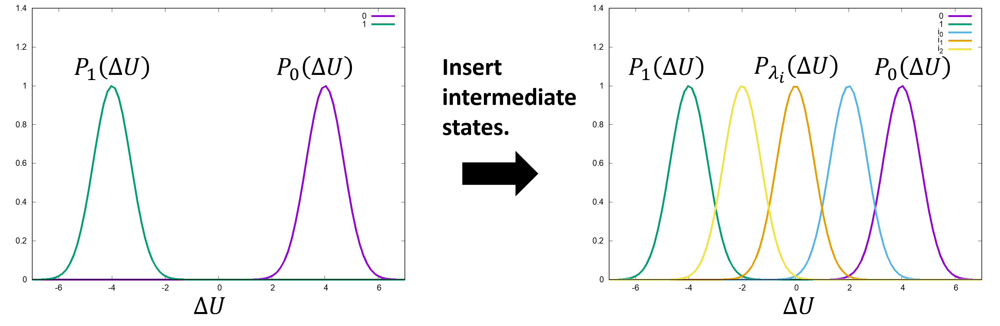
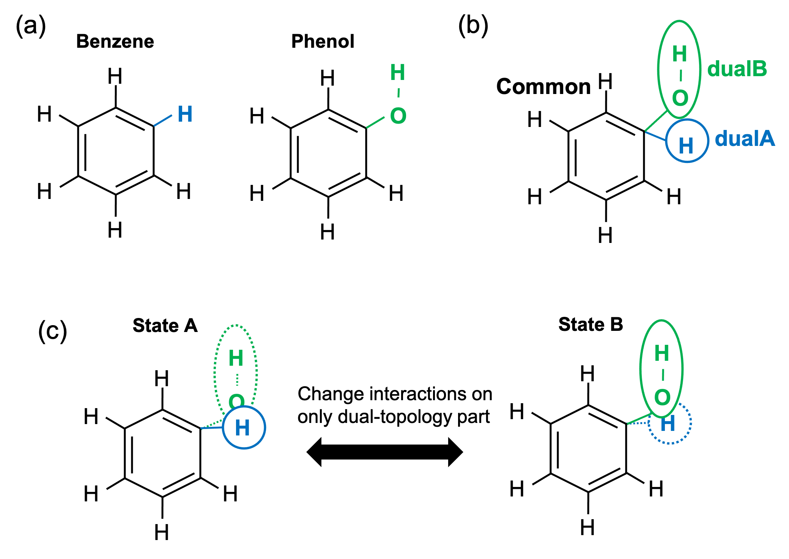
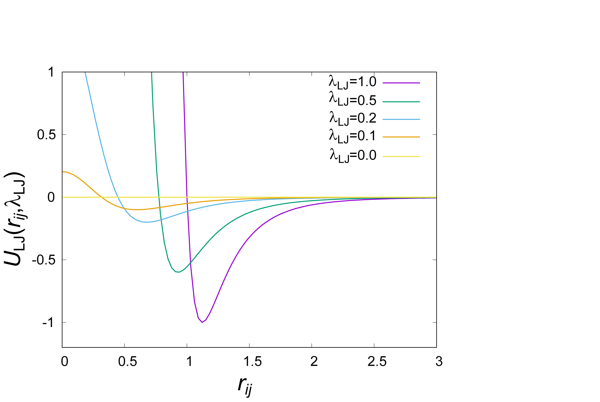

.. highlight:: bash
.. _alchemy:

=======================================================================
Alchemy section
=======================================================================

Free energy perturbation (FEP)
==============================

In the **[Alchemy]** section, the users can specify keywords for the free-energy perturbation (FEP) method, which is one of the alchemical free energy calculations.
The FEP method calculates the free-energy difference between two states by gradually changing a part of the system from one state to another. 
Since the free energy depends only on the initial and final states, any intermediate states can be chosen, regardless of whether they are physically realizable.
If the intermediate states are physically unrealizable but computationally realizable, the calculation and thermodynamic process are referred to as the alchemical free-energy calculation and alchemical process, respectively.
Using alchemical processes, the FEP method can be applied to various free-energy calculations, such as solvation free energies, binding free energies, and free-energy changes upon protein mutations.
In particular, absolute binding free energies can be calculated by gradually vanishing a ligand of interest, while relative binding free energies can be calculated by gradually changing one ligand to another.

GENESIS can perform various alchemical calculations using dual-topology and hybrid-topology approaches, soft-core potentials, and lambda-exchange calculations based on REMD.
GPGPU acceleration is also available in FEP simulations.
The short-range non-bonded interactions (LJ and PME real part) are calculated by GPU, while the long-range interactions (PME reciprocal part) are calculated by CPU.
Currently, **SPDYN** supports only CHARMM and AMBER force fields for FEP simulations.
The FEP method is not available in **ATDYN**.
This section briefly summarizes the FEP functions in GENESIS and shows some examples.

Theory of FEP
-------------

The FEP method calculates the free-energy difference between two states, A and B, using the following equation.

  .. raw:: latex

     \vspace{-5mm}

  .. math::  
     \Delta F &= F_{\text{B}} - F_{\text{A}} \\
	 &= -k_{\text{B}}T \ln \frac{\int dx \exp [-\beta U_{\text{B}}(x)]}{\int dx \exp [-\beta U_{\text{A}}(x)]} \\
	 &= -k_{\text{B}}T \ln \frac{\int dx \exp [-\beta U_{\text{A}}(x) - \beta \Delta U(x)]}{\int dx \exp [-\beta U_{\text{A}}(x)]} \\
	 &= -k_{\text{B}}T \ln \left< \exp [-\beta \Delta U(x)]\right>_{\text{A}},

  .. raw:: latex

     \vspace{-3mm}

where :math:`F` and :math:`U` are the free energy and potential energy of state A or B, :math:`\Delta U` is the difference between :math:`U_{\text{A}}` and :math:`U_{\text{B}}`, and :math:`x` is the configuration of the system.
The bracket in the final line represents the ensemble average at state A.
This equation means that :math:`\Delta F` can be estimated by sampling only equilibrium configurations of the state A.
However, if :math:`\Delta U` is considerably large, there will be a little energy-distribution overlap (Left of :numref:`intermediate_states`).  In this case, configurations at state B are poorly sampled by simulations at the state A, leading to significant statistical errors.
To reduce the errors, :math:`n-2` intermediate states are inserted between states A and B to guarantee overlaping energy distributions (Right of :numref:`intermediate_states`).
The potential energy of the intermediate state :math:`i` is defined by :math:`U(\lambda_i) = (1-\lambda_i) U_{\text{A}} + \lambda_i U_{\text{B}}`, where :math:`\lambda_i` is the scaling parameter for connecting the initial and final states.
By changing :math:`\lambda_i` from A to B, states A and B can be connected smoothly.
:math:`\Delta F` can be estimated by calculating the summation of free-energy changes between adjacent states:

  .. raw:: latex

     \vspace{-5mm}

  .. math::  
     \Delta F &= \sum_{i=0}^{n-1}\Delta F_i \\
	 &= -k_B T \sum_{i=0}^{n-1} \ln \left< \exp [-\beta (U(\lambda_i+1)-U(\lambda_i))]\right>_{\lambda_i},

  .. raw:: latex

     \vspace{-3mm}

where the subscript :math:`\lambda_i` represents the ensemble average at state :math:`i`.
The states of :math:`i = 0` and :math:`n` correspond to state A and B, respectively.

   Insertion of intermediate states. Some intermediate states are inserted between the reference and target states to overlap energy distributions.

Modified Hamiltonian
--------------------

In conventional FEP (cFEP), to smoothly connect two thermodynamic states, the scaling factors of :math:`\lambda_i` are introduced to the non-bonded energy as described above.
However, when the PME method is used for electrostatic calculations, cFEP requires two reciprocal-space calculations, because :math:`U_{\text{A}}` and :math:`U_{\text{B}}` must be individually calculated to obtain the total electrostatic energy.
This implies that twice FFT calculates must be required every time step compared to normal MD simulations, which largely decreases the computational performance.
In particular for large chemical or biological systems, it is computational expensive, because the computational time of the FFT calculation increases as :math:`O(N \log N)`, where :math:`N` is the number of degrees of freedom in the system.

To overcome the problem in cFEP, instead of interpolation of the end state potential energies, another scaling method is proposed :cite:`Jorgensen:1985,Mezei:1986,Giese2018,Oshima:2022`. The partial charge of atom :math:`\alpha`, :math:`q_\alpha`, which is involved in the perturbed parts (parts A or B), is scaled by :math:`1-\lambda_i` or :math:`\lambda_i`.
The interactions between non-perturbed atoms are not changed by this scaling, while the interactions between a perturbed atom and a non-perturbed one are changed as:

  .. raw:: latex

     \vspace{-5mm}

  .. math::  
     U_{\alpha \beta}^{\text{pert-nonpert}}(\lambda_i) &= \frac{(\lambda_i q_{\alpha}) q_{\beta}}{\epsilon r_{\alpha\beta}} \\
     &= \lambda_i \frac{q_{\alpha} q_{\beta}}{\epsilon r_{\alpha\beta}} \\
     &= \lambda_i U_{\alpha \beta}^{\text{pert-nonpert}},

  .. raw:: latex

     \vspace{-3mm}

where :math:`U_{\alpha \beta}^{\text{pert-nonpert}}` is an interaction energy between atoms :math:`\alpha` and :math:`\beta`, which are perturbed and non-perturbed atoms, respectively.
:math:`U_{\alpha \beta}^{\text{pert-nonpert}}` without argument represents the non-scaled interaction (i.e., original one).
Similarly, the interactions between perturbed atoms are changed as:

  .. raw:: latex

     \vspace{-5mm}

  .. math::  
     U_{\alpha \beta}^{\text{pert-pert}}(\lambda_i) &= \frac{(\lambda_i q_{\alpha}) (\lambda_i q_{\beta})}{\epsilon r_{\alpha\beta}} \\
     &= \lambda_i^2 \frac{q_{\alpha} q_{\beta}}{\epsilon r_{\alpha\beta}} \\
     &= \lambda_i^2 U_{\alpha \beta}^{\text{pert-pert}}

  .. raw:: latex

     \vspace{-3mm}

Since each energy term is scaled by 1, :math:`\lambda_i`, or :math:`\lambda_i^2`, the non-uniform scaling of :math:`\lambda_i` is introduced into the Hamiltonian.
The partial charge scaling can be considered just as the modification of the force field parameters, which implies that
the modified Hamiltonian corresponds to the normal Hamiltonian for the system with the modified partial charges.
The modified Hamiltonian can be calculated by applying the normal PME method (i.e., only one reciprocal-space calculation per each time step) to the system with the modified partial charges.
The scheme of the modified Hamiltonian is referred to as modified FEP :cite:`Oshima:2022`.

We note that the alchemical calculation paths used in cFEP and modified FEP are different.
In intermediate states, the non-bonded energies of cFEP and modified FEP are different, even if the same lambda value is used.
However, modified FEP can reproduce the results for cFEP, because the free-energy change depends only on the end states, at which both methods can correspond to states A or B :cite:`Oshima:2022`.
The reduction of PME reciprocal-space calculations greatly improves the computational performance, in particular in the CPU+GPU hybrid computation (at most 35% speeding-up) :cite:`Oshima:2022`.
The modified scaling can be applied to the LJ energy: :math:`\epsilon` of atom :math:`i` is scaled by :math:`1-\lambda_i` or :math:`\lambda_i` :cite:`Giese2018`.
In GENESIS version 2.1 or later, modified scalings for LJ and electrostatic energies are employed.

Dual topology approach
----------------------

One of the most important applications of the FEP method is the calculation of protein-ligand binding affinity, which represents how strong a ligand binds to a protein.
Drug discovery aims to find the optimal ligand from a large number of chemical compounds that bind on the target protein.
The difference between binding affinities of two ligands, called the relative binding affinity, can be calculated by changing one ligand to another during the simulation.
For example, consider the mutation from benzene to phenol (:numref:`dual_topology` (a)).
States A and B represent benzene and phenol, respectively.
The atoms of benzene except for a hydrogen atom are common to both ligands, which thus are unnecessary to be perturbed.
On the other hand, the H atom of benzene and the OH atoms of phenol are different in their force field parameters and topologies.
To minimize perturbation and treat the topological difference, topologies of two ligands are unified such that the atoms with different topologies connect with the common atoms (:numref:`dual_topology` (b)).
This topology is called the dual topology, consisting of the common atoms, those included only in state A (dualA in :numref:`dual_topology` (b)), and those included only in state B (dualB in :numref:`dual_topology` (b)) :cite:`Gao:1989,Pearlman:1994,Axelsen:1998`.
The perturbation is applied to only the dualA and dualB parts.

   Dual topology approach. (a) Benzene and phenol. Common atoms, H atom of benzene, and OH atoms of phenol are in black, cyan, and green, respectively. (b) Dual topology of benzene and phenol. (c) The alchemical transformation from benzene to phenol.

The free-energy change upon the mutation can be calculated by gradually switching the interactions of the dual-topology part from benzene to phenol (:numref:`dual_topology` (c)).
At state A, only the H atom exists in the dual-topology part, whereas the OH atoms do not interact with the other atoms in the system.
During the alchemical transformation, the H atom gradually disappears, while the OH atoms gradually appears.
At state B, only the OH atoms exist in the dual-topology part and interact with the other atoms.
The non-bonded potential energy is defined as the following to smoothly connect state A with state B, by introducing :math:`\lambda_{LJ}` and :math:`\lambda_{elec}`:

  .. raw:: latex

     \vspace{-5mm}

  .. math::  
     U_{\text{nonbond}} &= U_{\text{LJ}}^{\text{other-other}} + U_{\text{LJ}}^{\text{other-common}} + U_{\text{LJ}}^{\text{common-common}} + U_{\text{elec}}^{\text{other-other}} + U_{\text{elec}}^{\text{other-common}} + U_{\text{elec}}^{\text{common-common}} \\
	 & + \lambda_{\text{LJ}}^A (U_{\text{LJ}}^{\text{other-dualA}} + U_{\text{LJ}}^{\text{common-dualA}}) + {\lambda_{\text{LJ}}^A}^2 U_{\text{LJ}}^{\text{dualA-dualA}} \\
	 & + \lambda_{\text{LJ}}^B (U_{\text{LJ}}^{\text{other-dualB}} + U_{\text{LJ}}^{\text{common-dualB}}) + {\lambda_{\text{LJ}}^B}^2 U_{\text{LJ}}^{\text{dualB-dualB}} \\
	 & + \lambda_{\text{elec}}^A (U_{\text{elec}}^{\text{other-dualA}} + U_{\text{elec}}^{\text{common-dualA}}) + {\lambda_{\text{elec}}^A}^2 U_{\text{elec}}^{\text{dualA-dualA}} \\
	 & + \lambda_{\text{elec}}^B (U_{\text{elec}}^{\text{other-dualB}} + U_{\text{elec}}^{\text{common-dualB}}) + {\lambda_{\text{elec}}^B}^2 U_{\text{elec}}^{\text{dualB-dualB}} \\
     & + \lambda_{\text{elec}}^A \lambda_{\text{elec}}^B U_{\text{elec}}^{\text{dualA-dualB}}

  .. raw:: latex

     \vspace{-3mm}

where "common", "dualA", "dualB", and "other" in the superscripts respectively represent the common atoms, the atoms existing only at state A, the atoms existing only at state B, and the other molecules including solvent molecules, proteins, or other ligands.
For example, :math:`U_{\text{LJ}}^{\text{common-dualA}}` represents the LJ interaction between a common atom and a dualA atom.
Here the modified Hamiltonian is employed for LJ and electrostatic potentials.
The potential energy at :math:`\lambda_{\text{LJ}}^{A}=1`, :math:`\lambda_{\text{elec}}^{A}=1`, :math:`\lambda_{\text{LJ}}^{B}=0`, and :math:`\lambda_{\text{elec}}^{B}=0` corresponds to that of state A, while the energy at :math:`\lambda_{\text{LJ}}^{A}=0`, :math:`\lambda_{\text{elec}}^{A}=0`, :math:`\lambda_{\text{LJ}}^{B}=1`, and :math:`\lambda_{\text{elec}}^{B}=1` corresponds to that of state B.
By gradually changing :math:`\lambda_{\text{LJ}}^{A}`, :math:`\lambda_{\text{elec}}^{A}`, :math:`\lambda_{\text{LJ}}^{B}`, and :math:`\lambda_{\text{elec}}^{B}`, states A and B can be connected smoothly.

In modified FEP, the cross term, :math:`U_{\text{elec}}^{\text{dualA-dualB}}`, appears in the electrostatic potential. Since this term becomes infinitely large when the dualA atoms overlap the dualB atoms, the term should be removed from the calculation of the potential. The real-space part (i.e., the short-range part) of the term can be excluded from the calculation, because the part is pairwise additive in the real-space calculation.
In contrast, the reciprocal-space part (i.e., long-range part) of the cross term cannot be removed because the PME reciprocal-space calculation includes all pair interactions involving A-B interactions.
However, this part of energy always has a small value even if the atoms in dualA and dualB parts overlap, and its gradient does not become infinite :cite:`Oshima:2022`.
In GENESIS, the real-space part of the cross term is removed using the exclusion list, while the reciprocal-space part is included in the potential energy.
The remaining cross term provides minor effect on the potential energy and might be not important in free-energy calculations :cite:`Oshima:2022`.

In GENESIS, the dual-topology approach is available by specifying **fep_topology = Dual** in the [ALCHEMY] section.
The users should select the atoms of the dual-topology part in the [SELECTION] section and assign their group numbers to **dualA** and **dualB** in the [ALCHEMY] section.
:math:`\lambda_{\text{LJ}}^{A}`, :math:`\lambda_{\text{elec}}^{A}`, :math:`\lambda_{\text{LJ}}^{B}`, and :math:`\lambda_{\text{elec}}^{B}` can be specified by **lambljA**, **lambljB**, **lambelA**, and **lambelB**, respectively.
An example is shown below.
::

  [ALCHEMY]
  fep_topology = Dual
  dualA        = 1  # group1 in [SELECTION]
  dualB        = 2  # group2 in [SELECTION]
  lambljA      = 1.00 0.75 0.50 0.25 0.00
  lambljB      = 0.00 0.25 0.50 0.75 1.00
  lambelA      = 1.00 0.75 0.50 0.25 0.00
  lambelB      = 0.00 0.25 0.50 0.75 1.00

  [SELECTION]
  group1       = ai:1    # atoms in dual A
  group2       = ai:2-3  # atoms in dual B

In this example, five sets of :math:`\lambda_{\text{LJ}}^{A}`, :math:`\lambda_{\text{elec}}^{A}`, :math:`\lambda_{\text{LJ}}^{B}`, and :math:`\lambda_{\text{elec}}^{B}` are used to connect state A to state B. 
In the [SELECTION] section, the H atom of benzene and the OH atoms of phenol are selected by group 1 and 2, respectively.
The group IDs are specified as **dualA = 1** and **dualB = 2**.

Hybrid topology approach
------------------------

In the dual-topology approach, the force field parameters of common atoms are assumed to be the same in both states.
However, in general, they should be different from each other. :numref:`hybrid_topology` (a) shows that the charge distribution on the aromatic ring of benzene is different from that of phenol.
The parameters of the common atoms for the bond, angle, and dihedral terms are also different between the two states.
To treat the difference in the force field parameters, one can superimpose the parts of the molecules with the same topology (:numref:`hybrid_topology` (b)) :cite:`Jiang:2019`.
The superimposed part has a single topology, in which the parts corresponding to states A and B are referred to as "singleA" and "singleB", respectively.
During FEP simulations, the single-topology part does not change its topology, but its force field parameters (charge, LJ, and internal bond) are gradually changed from state A to state B (:numref:`hybrid_topology` (c)).
In contrast, the other part has a dual topology, in which "dualA" and "dualB" correspond to states A and B, respectively.
In the dual-topology part, their topology and parameters are changed (:numref:`hybrid_topology` (c)).

.. figure:: _figures/Alchemy_Fig3.png
   :width: 70 %
   :align: center
   :name: hybrid_topology
   :alt: 

   Hybrid topology approach. (a) Benzene and phenol. H atom of benzene and OH atoms of phenol are in cyan and green, respectively. The point charges on common atoms are shown in red and magenda, which are determined using Amber Tools. (b) Hybrid topology of benzene and phenol. (c) The alchemical transformation from benzene to phenol.

In the hybrid topology approach, the potential energy is scaled by :math:`\lambda_{\text{LJ}}`, :math:`\lambda_{\text{elec}}`, and :math:`\lambda_{\text{bond}}`:

  .. raw:: latex

     \vspace{-5mm}

  .. math::  
     U_{\text{nonbond}} &= U_{\text{LJ}}^{\text{other-other}} + U_{\text{elec}}^{\text{other-other}} \\
	 & + \lambda_{\text{LJ}}^A (U_{\text{LJ}}^{\text{other-singleA}} + U_{\text{LJ}}^{\text{other-dualA}}) \\
     & + {\lambda_{\text{LJ}}^A}^2 (U_{\text{LJ}}^{\text{singleA-singleA}} + U_{\text{LJ}}^{\text{singleA-dualA}} + U_{\text{LJ}}^{\text{dualA-dualA}}) \\
	 & + \lambda_{\text{LJ}}^B (U_{\text{LJ}}^{\text{other-singleB}} + U_{\text{LJ}}^{\text{other-dualB}}) \\
     & + {\lambda_{\text{LJ}}^B}^2 (U_{\text{LJ}}^{\text{singleB-singleB}} + U_{\text{LJ}}^{\text{singleB-dualB}} + U_{\text{LJ}}^{\text{dualB-dualB}}) \\
	 & + \lambda_{\text{elec}}^A (U_{\text{elec}}^{\text{other-singleA}} + U_{\text{elec}}^{\text{other-dualA}}) \\
     & + {\lambda_{\text{elec}}^A}^2 (U_{\text{elec}}^{\text{singleA-singleA}} + U_{\text{elec}}^{\text{singleA-dualA}} + U_{\text{elec}}^{\text{dualA-dualA}}) \\
	 & + \lambda_{\text{elec}}^B (U_{\text{elec}}^{\text{other-singleB}} + U_{\text{elec}}^{\text{other-dualB}}) \\
     & + {\lambda_{\text{elec}}^B}^2 (U_{\text{elec}}^{\text{singleB-singleB}} + U_{\text{elec}}^{\text{singleB-dualB}} + U_{\text{elec}}^{\text{dualB-dualB}}) \\
     & + \lambda_{\text{elec}}^A \lambda_{\text{elec}}^B (U_{\text{elec}}^{\text{singleA-singleB}} + U_{\text{elec}}^{\text{singleA-dualB}} + U_{\text{elec}}^{\text{dualA-singleB}} + U_{\text{elec}}^{\text{dualA-dualB}}) \\
     \\
     U_{\text{bond}} &= U_{\text{bond}}^{\text{other}} + U_{\text{bond}}^{\text{dualA}} + U_{\text{bond}}^{\text{dualB}} + U_{\text{bond}}^{\text{singleA-dualA}} + U_{\text{bond}}^{\text{singleB-dualB}} \\
	 & + \lambda_{\text{bond}}^A (U_{\text{bond}}^{s\text{ingleA}}) \\
	 & + \lambda_{\text{bond}}^B (U_{\text{bond}}^{\text{singleB}}) \\

  .. raw:: latex

     \vspace{-3mm}

where "singleA", "singleB", "dualA", and "dualB" in the superscripts respectively represent the atoms corresponding to "singleA", "singleB", "dualA", and "dualB" parts, respectively, and "other" represents the other molecules including solvent molecules, proteins, or other ligands.
Here the modified Hamiltonian is employed for LJ and electrostatic potentials.
The potential energy at :math:`\lambda_{\text{LJ}}^{A}=1`, :math:`\lambda_{\text{elec}}^{A}=1`, :math:`\lambda_{\text{bond}}^{A}=1`, :math:`\lambda_{\text{LJ}}^{B}=0`, :math:`\lambda_{\text{elec}}^{B}=0`, and :math:`\lambda_{\text{bond}}^{B}=0` corresponds to that of state A,
while the energy at :math:`\lambda_{\text{LJ}}^{A}=0`, :math:`\lambda_{\text{elec}}^{A}=0`, :math:`\lambda_{\text{bond}}^{A}=0`, :math:`\lambda_{\text{LJ}}^{B}=1`, :math:`\lambda_{\text{elec}}^{B}=1`, and :math:`\lambda_{\text{bond}}^{B}=1` corresponds to that of state B.
By gradually changing the lambda values, states A and B can be connected smoothly.

Similar to the dual-topology apporach, there are some cross terms in the modified potential energy for the hybrid-topology approach.
In GENESIS, the real-space part of the cross term is removed using the exclusion list, while the reciprocal-space part is included in the potential energy.

In GENESIS, the hybrid-topology approach is available by specifying **fep_topology = Hybrid** in the [ALCHEMY] section.
The users should select the atoms of the single-topology and dual-topology parts in the [SELECTION] section and assign their group numbers to **singleA**, **singleB**, **dualA**, and **dualB** in the [ALCHEMY] section.
:math:`\lambda_{\text{LJ}}^{A}`, :math:`\lambda_{\text{elec}}^{A}`, :math:`\lambda_{\text{bond}}^{A}`, :math:`\lambda_{\text{LJ}}^{B}`, :math:`\lambda_{\text{elec}}^{B}`, and :math:`\lambda_{\text{bond}}^{B}` can be specified by **lambljA**, **lambljB**, **lambelA**, and **lambelB**, respectively.
An example is shown below.
::

  [ALCHEMY]
  fep_topology = Hybrid
  singleA      = 1  # group1 in [SELECTION]
  singleB      = 2  # group2 in [SELECTION]
  dualA        = 3  # group3 in [SELECTION]
  dualB        = 4  # group4 in [SELECTION]
  lambljA      = 1.00 0.75 0.50 0.25 0.00
  lambljB      = 0.00 0.25 0.50 0.75 1.00
  lambelA      = 1.00 0.75 0.50 0.25 0.00
  lambelB      = 0.00 0.25 0.50 0.75 1.00
  lambbondA    = 1.00 0.75 0.50 0.25 0.00
  lambbondB    = 0.00 0.25 0.50 0.75 1.00

  [SELECTION]
  group1       = ai:1-11   # atoms in single A
  group2       = ai:13-23  # atoms in single B
  group3       = ai:12     # atoms in dual A
  group4       = ai:24-25  # atoms in dual B

In this example, five sets of the lambda values are used to connect state A to state B.
In the **[SELECTION]** section, 
the aromatic ring of benzene, the aromatic ring of phenol, the H atom of benzene, and the OH atoms of phenol are selected by group 1, 2, 3, and 4, respectively.
The group IDs are specified as **singleA = 1**, **singleB = 2**, **dualA = 3**, and **dualB = 4**.

The hybrid-topology approach in GENESIS requires single-topology parts. If **singleA** and **singleB** are not specified with **fep_topology = Hybrid**, GENESIS stops calculations.
When the perturbed region includes only dual-topology parts, **fep_topology = Dual** should be used.

Soft core potentials
--------------------

In regions near the end points of alchemical calculations (:math:`\lambda_{\text{LJ}} = 0` or 1),
overlaps may occur between perturbed atoms or between perturbed and non-perturbed atoms, resulting in large energy changes.
Consequently, the system may become unstable and the simulations may crash, which is called the end point catastrophe.
To avoid the catastrophe, a "soft core" is introduced to the LJ potential :cite:`Zacharias:1994`:

  .. raw:: latex

     \vspace{-5mm}

  .. math::  
     U_{\text{LJ}}(r_{ij}, \lambda_{\text{LJ}}) = 4 \lambda_{\text{LJ}}\, \epsilon \left[ \left( \frac{\sigma^2}{r_{ij}^2+\alpha_{sc} (1-\lambda_{\text{LJ}})} \right)^6 - \left( \frac{\sigma^2}{r_{ij}^2+\alpha_{sc} (1-\lambda_{\text{LJ}})} \right)^3 \right],

  .. raw:: latex

     \vspace{-3mm}

where :math:`\alpha_{\text{sc}}` is the parameter for the soft-core potential.
In the potential, :math:`r_{ij}^2` is shifted by :math:`\alpha_{\text{sc}} (1-\lambda_{\text{LJ}})`, which weakens the repulsive part in the LJ potential when :math:`\lambda_{\text{LJ}}` approaches 0 (:numref:`LJ_softcore`).
It is important that the soft-core potential equals to the original LJ potential at the two end points of :math:`\lambda_{\text{LJ}}`:

  .. raw:: latex

     \vspace{-5mm}

  .. math::  
     U_{\text{LJ}}(r_{ij}, \lambda_{\text{LJ}}=1) &= 4 \epsilon \left[ \left( \frac{\sigma}{r_{ij}} \right)^{12} - \left( \frac{\sigma}{r_{ij}} \right)^6 \right], \\
     U_{\text{LJ}}(r_{ij}, \lambda_{\text{LJ}}=0) &= 0,

  .. raw:: latex

     \vspace{-3mm}

therefore, the soft-core modification in the LJ potential does not affect the free-energy calculation.
:math:`\alpha_{\text{sc}}` can be specified by a keyword **sc_alpha** in the GENESIS control file.

   Soft core potential for Lennard-Jones interaction.

In GENESIS, the soft core is also applied to the electrostatic potential :cite:`Steinbrecher:2011`:

  .. raw:: latex

     \vspace{-5mm}

  .. math::  
     U_{\text{elec}}(r_{ij}, \lambda_{\text{elec}}) = \lambda_{\text{elec}} \frac{q_i q_j \text{erfc} (\alpha \sqrt{r_{ij}^2 + \beta_{sc} (1-\lambda_{\text{elec}})})}{\epsilon \sqrt{r_{ij}^2 + \beta_{sc} (1-\lambda_{\text{elec}})}} + \lambda_{\text{elec}} (\text{PME reciprocal and self terms}),

  .. raw:: latex

     \vspace{-3mm}

where :math:`\beta_{\text{sc}}` is the parameter for the electrostatic soft-core potential.
In the potential, :math:`r_{ij}^2` is also shifted to :math:`\beta_{\text{sc}} (1-\lambda_{\text{elec}})` like the LJ soft-core potential, which softens disruptions due to overlaps of point charges.
This soft-core potential is almost the same as used in Amber :cite:`Steinbrecher:2011`.
:math:`\beta_{\text{sc}}` can be specified by a keyword **sc_beta** in the GENESIS control file.

In GENESIS, the soft-core potentials are applied only to dual-topology parts. The non-bonded interactions in the single-topology parts are not modified. 

FEP/:math:`\lambda`-REMD
------------------------

To enhance the sampling efficiency, the FEP simulations at different :math:`\lambda` values are coupled using the Hamiltonian replica exchange method :cite:`Sugita:2000,Fukunishi:2002`.
This method is called FEP/:math:`\lambda`-REMD or :math:`\lambda`-exchange FEP :cite:`Jiang:2009`.
Replicas run in parallel and exchange their parameters at fixed intervals during the simulation.
The exchanges between adjacent replicas are accepted or rejected according to Metropolis’s criterion.
In FEP/:math:`\lambda`-REMD simulations, [REMD] section is also required.
**type1 = alchemy** is set to exchange the lambda values.
The following is an example of the control file for the FEP/:math:`\lambda`-REMD simulation.

::

  [REMD]
  dimension       = 1
  exchange_period = 500
  type1           = alchemy
  nreplica1       = 5

  [ALCHEMY]
  fep_topology = Hybrid
  singleA      = 1  # group1 in [SELECTION]
  singleB      = 2  # group2 in [SELECTION]
  dualA        = 3  # group3 in [SELECTION]
  dualB        = 4  # group4 in [SELECTION]
  lambljA      = 1.00 0.75 0.50 0.25 0.00
  lambljB      = 0.00 0.25 0.50 0.75 1.00
  lambelA      = 1.00 0.75 0.50 0.25 0.00
  lambelB      = 0.00 0.25 0.50 0.75 1.00
  lambbondA    = 1.00 0.75 0.50 0.25 0.00
  lambbondB    = 0.00 0.25 0.50 0.75 1.00

  [SELECTION]
  group1       = ai:1-11   # atoms in single A
  group2       = ai:13-23  # atoms in single B
  group3       = ai:12     # atoms in dual A
  group4       = ai:24-25  # atoms in dual B

Parameters for alchemy section
==============================

**fep_direction** *Bothsides / Forward / Reverse*

  **Default: Bothsides**

  Direction of calculation of energy difference.
  When the current state of the simulation or the replica is :math:`i`,
  GENESIS outputs the energy difference between state :math:`i` and the adjacent state at a frequency determined by **fepout_period**.
  If **fep_direction = Forward**, the energy difference between states :math:`i` and :math:`i+1` is output.
  If **fep_direction = Reverse**, the energy difference between states :math:`i` and :math:`i-1` is output.
  If **fep_direction = Bothsides**, the energy differences between states :math:`i` and :math:`i-1` and between states :math:`i` and :math:`i+1` are output.

**fepout_period** *Integer*

  **Default: 100**

  Period of outputting energy differences.
  The energy differences are output to the file specified by **fepfile** in the **[OUTPUT]** section.
  If **fepout_period = 0**, the energy differences are not output and no **fepfile** is generated.

**fep_topology** *Dual / Hybrid*

  **Default: Hybrid**

  Topology of perturbed region.
  If **fep_topology = Dual**, the dual-topology approach is used.
  If **fep_topology = Hybrid**, the hybrid-topology approach is used.

**singleA** *Integer* or *None*

  **Default: N/A**

  Group index for the single topology region of state A.
  If **singleA = None**, calculations for the region are skipped.
  If **fep_topology = Hybrid**, this parameter must be specified.

**singleB** *Integer* or *None*

  **Default: N/A**

  Group index for the single topology region of state B.
  If **singleB = None**, calculations for the region are skipped.
  If **fep_topology = Hybrid**, this parameter must be specified.

**dualA** *Integer* or *None*

  **Default: N/A**

  Group index for the dual topology region of state A.
  If **dualA = None**, calculations for the region are skipped.

**dualB** *Integer* or *None*

  **Default: N/A**

  Group index for the dual topology region of state B.
  If **dualB = None**, calculations for the region are skipped.

**sc_alpha** *Real*

  **Default: 5.0** (dimensionless)

  Parameter for the soft-core potential for the Lennard-Jones interaction.

**sc_beta** *Real*

  **Default: 0.5** (dimensionless)

  Parameter for the soft-core potential for the electrostatic interaction.

**equilsteps** *Integer*
 
  **Default: 0**

  Number of steps of equilibration at each lambda window.
  If **equilsteps > 0**, equilibration run is performed until the time step reaches **equilsteps**.
  During the equilibration, energy differences are not outputted.
  After the equilibration, production run is performed with outputting energy differences until the time step reaches **timesteps + equilsteps**.

**lambljA** *Real*

  **Default: 1.0**

  Scaling parameters for Lennard-Jones interactions in state A (:math:`\lambda_{\text{LJ}}^A`).

**lambljB** *Real*

  **Default: 1.0**

  Scaling parameters for Lennard-Jones interactions in state B (:math:`\lambda_{\text{LJ}}^B`).

**lambelA** *Real*

  **Default: 1.0**

  Scaling parameters for electrostatic interactions in state A (:math:`\lambda_{\text{elec}}^A`).

**lambelB** *Real*

  **Default: 1.0**

  Scaling parameters for electrostatic interactions in state B (:math:`\lambda_{\text{elec}}^B`).

**lambbondA** *Real*

  **Default: 1.0**

  Scaling parameters for bonded interactions in state A (:math:`\lambda_{\text{bond}}^A`).

**lambbondB** *Real*

  **Default: 1.0**

  Scaling parameters for bonded interactions in state B (:math:`\lambda_{\text{bond}}^B`).

**lambrest** *Real*

  **Default: 1.0**

  Scaling parameters for restraint interactions (:math:`\lambda_{\text{rest}}`).

**fep_md_type** *Serial / Single / Parallel*

  **Default: Serial**

  Type of FEP simulation.
  If **fep_md_type = Serial**, FEP simulations are performed with changing lambda values specified in **lambljA**, **lambljB**, **lambelA**, etc. For example, if 0.0, 0.5, and 1.0 are specified in **lambljA**, GENESIS first performs the FEP simulation with **lambljA = 0.0**, subsequently performs the FEP simulation with **lambljA = 0.5**, and finally performs the FEP simulation with **lambljA = 1.0**.
  If **fep_md_type = Single**, a FEP simulation is performed with the lambda window specified in **ref_lambid**.
  If **fep_md_type = Parallel**, each lambda window is simulated in parallel. In this case, **[REMD]** section must be specified.

**ref_lambid** *Integer*

  **Default: 0**

  Reference window id for a single FEP MD simulation.
  If **fep_md_type = Single**, **ref_lambid** must be specified.

Examples
========

Example of a calculation of the solvation free energy of a ligand.
The solvation free energy corresponds to the free-energy change upon the transfer of the ligand from vacuum to solvent.
In state A (= in solvent) the ligand fully interacts with solvent molecules, whereas in state B (= in vacuum) those interactions vanishes.
To perform such calculation, the dual topology is employed, and **dualA** is set to the group ID of the selected ligand, while **dualB** is set to **NONE**.
**dualB = NONE** means that there is no ligand in the system at state B.
**lambljA**, **lambljB**, **lambelA**, and **lambelB** should be zero at state B.
::
  
    [ALCHEMY]
    fep_direction = Bothsides
    fep_topology  = Dual
    singleA       = NONE
    singleB       = NONE
    dualA         = 1
    dualB         = NONE
    fepout_period = 500
    equilsteps    = 0
    sc_alpha      = 5.0
    sc_beta       = 0.5
    lambljA       = 1.000 1.000 1.000 1.000 1.000 0.750 0.500 0.250 0.000
    lambljB       = 0.000 0.000 0.000 0.000 0.000 0.000 0.000 0.000 0.000
    lambelA       = 1.000 0.750 0.500 0.250 0.000 0.000 0.000 0.000 0.000
    lambelB       = 0.000 0.000 0.000 0.000 0.000 0.000 0.000 0.000 0.000
    lambbondA     = 1.000 1.000 1.000 1.000 1.000 1.000 1.000 1.000 1.000
    lambbondB     = 0.000 0.000 0.000 0.000 0.000 0.000 0.000 0.000 0.000
    lambrest      = 1.000 1.000 1.000 1.000 1.000 1.000 1.000 1.000 1.000

    [SELECTION]
    group1 = segid:LIG

Example of an alchemical transformation between two ligands using serial FEP simulations.
When the [REMD] section is not specified and more than one lambda values are specified,
GENESIS performs serial calculations by changing lambda values.
If **fep_direction** is **Bothsides**, **lambljA**, **lambljB**, **lambelA**, **lambelB**, **lambbondA**,
and **lambbondB** are first set to the leftmost values,
which are "1.00", "0.00", "1.00", "0.00", "1.00", and "0.00", respectively, in the below example.
After the **equilsteps + nsteps**-steps FEP simulation is performed with the set of the lambda values, the lambda values are changed to the second values from the left.
In this way, GENESIS performs FEP simulations, changing lambda values.
When the FEP simulation with the rightmost values of lambda finishes, GENESIS stops the calculation.
::

    [ALCHEMY]
    fep_direction = Bothsides
    fep_topology  = Hybrid
    singleA       = 1  # group1 in [SELECTION]
    singleB       = 2  # group2 in [SELECTION]
    dualA         = 3  # group3 in [SELECTION]
    dualB         = 4  # group4 in [SELECTION]
    fepout_period = 500
    equilsteps    = 0
    sc_alpha      = 5.0
    sc_beta       = 5.0
    lambljA       = 1.00 0.75 0.50 0.25 0.00
    lambljB       = 0.00 0.25 0.50 0.75 1.00
    lambelA       = 1.00 0.75 0.50 0.25 0.00
    lambelB       = 0.00 0.25 0.50 0.75 1.00
    lambbondA     = 1.00 0.75 0.50 0.25 0.00
    lambbondB     = 0.00 0.25 0.50 0.75 1.00

    [SELECTION]
    group1        = ai:1-11   # atoms in single A
    group2        = ai:13-23  # atoms in single B
    group3        = ai:12     # atoms in dual A
    group4        = ai:24-25  # atoms in dual B

Example of an alchemical transformation between two ligands at a set of lambda values.
If the user wants to perform a FEP simulation with a specified set of lambda values,
set **fep_md_type** to **Single** and assign the ID of the set of lambda values to **ref_lambid**.
In the following example, **ref_lambid** is set to 3, which means that the third column of the lambda values:
**lambljA = 0.5**, **lambljB = 0.5**, **lambelA = 0.5**, **lambelB = 0.5**, **lambbondA = 0.5**, and **lambbondB = 0.5**.
If **fep_direction = Bothsides**, the energy differences between "**ref_lambid**"-th and "**ref_lambid** -1"-th columns and between "**ref_lambid**"-th and "**ref_lambid** +1"-th columns are outputted into the fepout file.
By using these function, the user can independently perform FEP simulations with different lambda values in parallel.
::

    [ALCHEMY]
    fep_direction   = Bothsides
    fep_topology    = Hybrid
    fep_md_type     = Single
    ref_lambid      = 3
    singleA         = 1  # group1 in [SELECTION]
    singleB         = 2  # group2 in [SELECTION]
    dualA           = 3  # group3 in [SELECTION]
    dualB           = 4  # group4 in [SELECTION]
    fepout_period   = 500
    equilsteps      = 0
    sc_alpha        = 5.0
    sc_beta         = 5.0
    lambljA         = 1.00 0.75 0.50 0.25 0.00
    lambljB         = 0.00 0.25 0.50 0.75 1.00
    lambelA         = 1.00 0.75 0.50 0.25 0.00
    lambelB         = 0.00 0.25 0.50 0.75 1.00
    lambbondA       = 1.00 0.75 0.50 0.25 0.00
    lambbondB       = 0.00 0.25 0.50 0.75 1.00

    [SELECTION]
    group1          = ai:1-11   # atoms in single A
    group2          = ai:13-23  # atoms in single B
    group3          = ai:12     # atoms in dual A
    group4          = ai:24-25  # atoms in dual B

Example of an alchemical transformation between two ligands using a parallel FEP simulation.
When the [REMD] section is specified, GENESIS performs the FEP/:math:`\lambda`-REMD simulation.
Each lambda value in **lambljA**, **lambljB**, **lambelA**, **lambelB**, **lambbondA**, and **lambbondB**
is assigned to each replica, and the FEP simulation in each replica is performed in parallel.
The lambda values are exchanged at fixed intervals specified by **exchange_period** during the simulation.
::

    [REMD]
    dimension       = 1
    exchange_period = 1000
    type1           = alchemy
    nreplica1       = 5

    [ALCHEMY]
    fep_direction   = Bothsides
    fep_topology    = Hybrid
    singleA         = 1  # group1 in [SELECTION]
    singleB         = 2  # group2 in [SELECTION]
    dualA           = 3  # group3 in [SELECTION]
    dualB           = 4  # group4 in [SELECTION]
    fepout_period   = 500
    equilsteps      = 0
    sc_alpha        = 5.0
    sc_beta         = 5.0
    lambljA         = 1.00 0.75 0.50 0.25 0.00
    lambljB         = 0.00 0.25 0.50 0.75 1.00
    lambelA         = 1.00 0.75 0.50 0.25 0.00
    lambelB         = 0.00 0.25 0.50 0.75 1.00
    lambbondA       = 1.00 0.75 0.50 0.25 0.00
    lambbondB       = 0.00 0.25 0.50 0.75 1.00

    [SELECTION]
    group1          = ai:1-11   # atoms in single A
    group2          = ai:13-23  # atoms in single B
    group3          = ai:12     # atoms in dual A
    group4          = ai:24-25  # atoms in dual B

